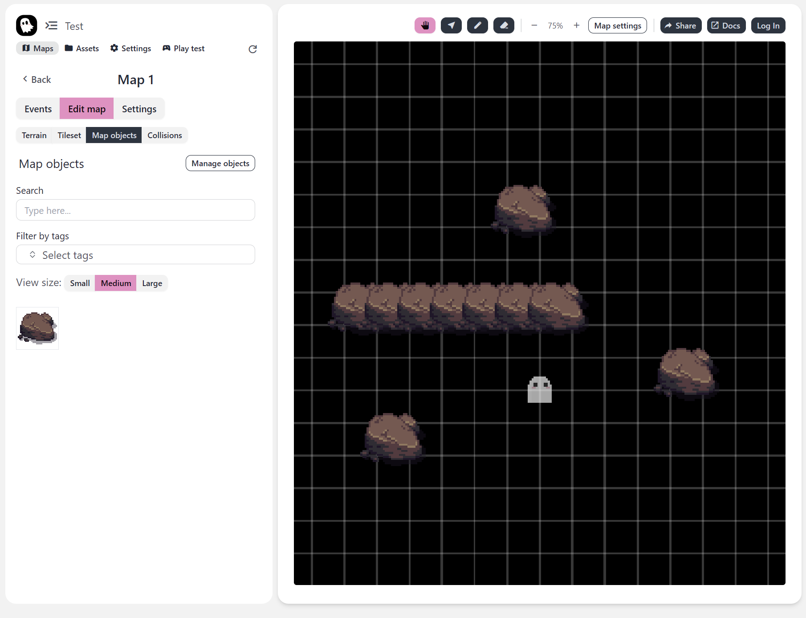
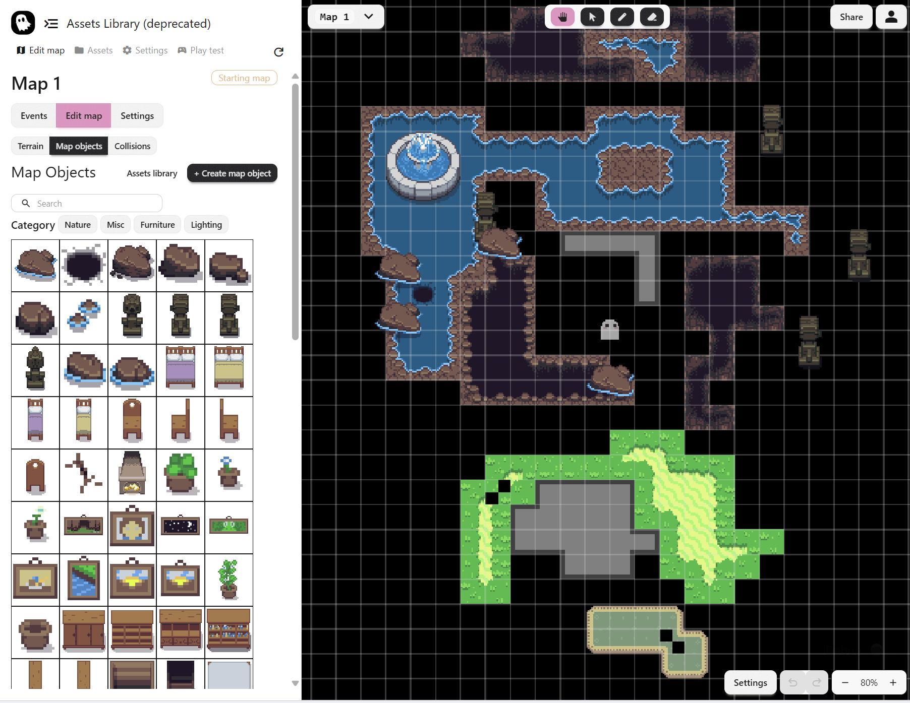

## Major Map Editor Overhaul

Overall, I would describe the focus of this update as a general UI/UX improvement to the map editor.

The major additions include support for multiple tilesets, support for undo redo in map editor, improved tools and map panning, and consolidating the active map while editing your story. The changelog for this update describes all the changes pretty well.

Unfortunately, I did have to do a breaking change in this update. If you had a tileset in your game, it will no longer be supported since we migrated to a system with multiple tilesets. The previous system was not great nor was it future proof, and supporting it would have increased the scope dramatics, delaying this update. Good thing we're still in beta!

Here is the old and new map editor screenshots. We focused on reducing the waste of space and making everything look nicer. When they're next to each other, you can really see the difference!

Old UI

New UI

Thanks for reading, I encourage you guys to try out the new map editor and let me know how it is! My email is truman@pixelstories.io

### Changelog

- [Editor] Fix empty project name. Set default name "A New Beginning."
- [Terrain Tilesets] Support for multiple tilesets in a map. **Breaking change**, all previous maps that used the single tileset will not be supported.
- [Editor] Game canvas now uses all screen space.
- [Editor] Added undo redo for all map editor tool actions.
- [Editor] Fixed buggy panning in game canvas when panning slowly.
- [Editor] Added new way to add map collisions, with dragging and resizing map collisions rectangles.
- [Editor] Consolidated how map switching is done by moving the map switcher to the map editor.
- [Editor] Added search and categorization functionality to map objects.
- [Assets] Moved terrains and map objects configuration from assets page to map editor side panel.
- [Terrain Tilesets] Added functionality to draw a rectangular selection of tiles from tilesets.
- [Misc] Update dependencies
