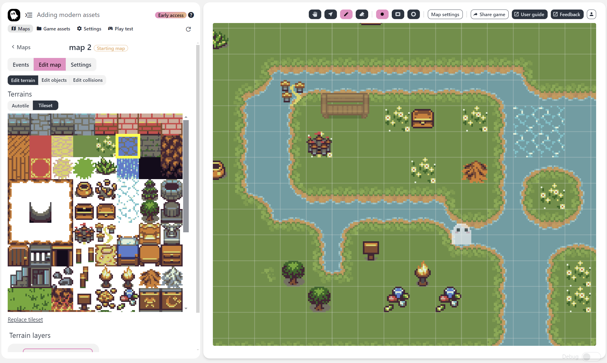
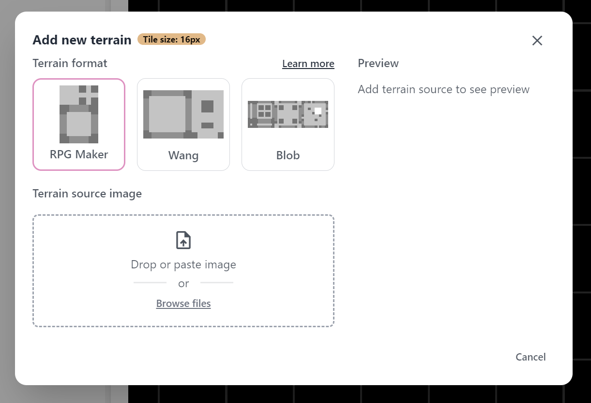
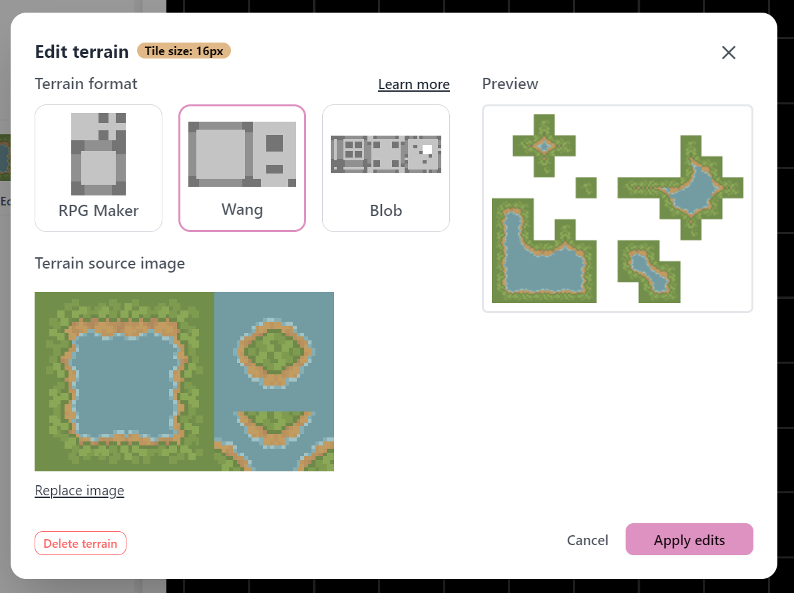

# Improved Terrain Creation and Map Editing

With our latest update, creating terrain and editing the map in the editor gets a refresh to be more flexible than ever! Here's a quick overview of the update.

### Individual Tile Placement

You can now place individual tiles directly on the map using an expandedable "single tile tileset." This feature is ideal for adding variety to your terrain, such as different grass or stone tiles and details that don’t align well with autotiling—like waterfalls, staircases, rocks, signs, and flower pots.

Adding a way to place single tiles also made it possible to fill in a terrain. In the example below, the water with land borders is the auto-tile and the grass interior is made up of single green tiles. Without single tile placement, you would have had to hack it in by creating a solid color auto-tile.

**Note**: If you’re placing tiles that players should walk behind, use the [Map Objects feature](https://pixelstories.io/features/map-editor/#map-objects) instead!

### New Terrain Creation Workflow

We’ve streamlined the workflow for creating terrain. The updated UI allows for a clearer, more intuitive experience, making terrain creation more accessible.

### Support for Blob, Wang, and RPG Maker Auto-tiles

The editor now supports Blob, Wang, and RPG Maker tileset formats. The good thing about these formats is that I found them to be the most widely used and you can easily transform into them if your tileset isn't in that specific format. If you believe another auto-tile format should be added which I've missed, let me know in our [official Discord](https://discord.gg/XN9EaUh26g)!

### Change Log

Added

- [Map terrains, Editor] Expandable single tile tileset and individual tile placement
- [Map terrains] New modal for creating auto-tile terrains with clear format mode selection
- [Map terrains] Support for blob auto-tile format
- [Editor] Zoom in and out in editor (ctrl + scroll wheel)

Changed

- [Editor] Game window in editor takes up entire screen view instead of only limiting to game’s view
- [Terrain layers] New layer is added on top of list instead of below
- [Map terrains, Map objects] Temporarily remove terrain and objects library (better default assets coming soon)

Fixed

- [Map terrains] Fix “Wang” format incorrectly generating the auto-tileset at corners
- [Editor] Restarting game did not properly signal for UI updates
- [Terrain layers, Editor] Drawing on hidden terrain layers
- [Customize Dialog] Game camera moving when customizing dialog box
