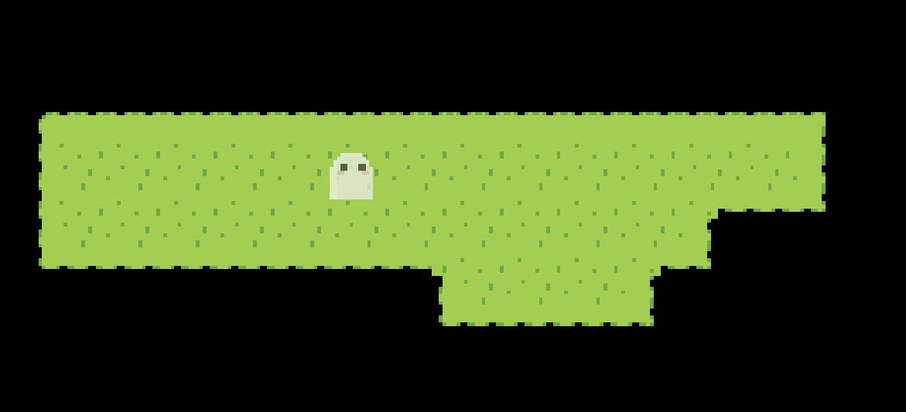
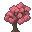
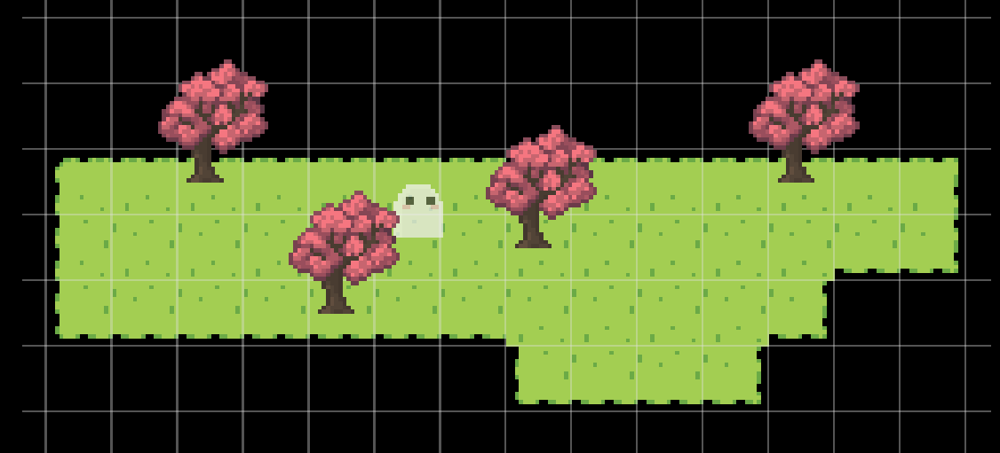
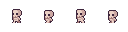
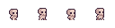
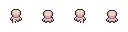
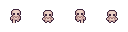
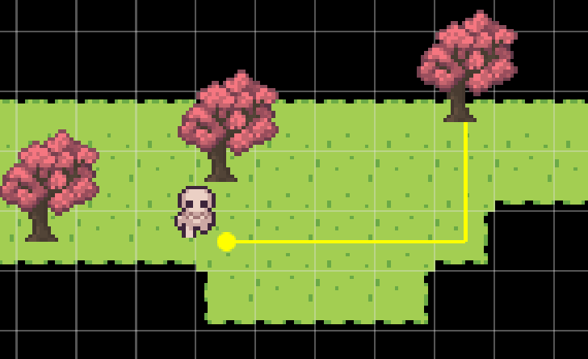
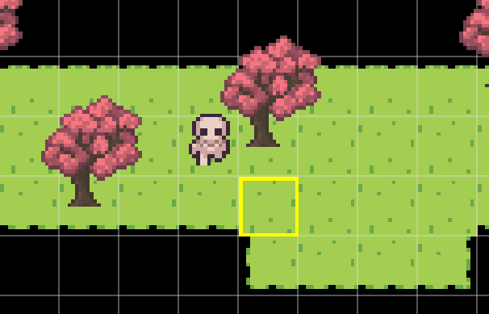
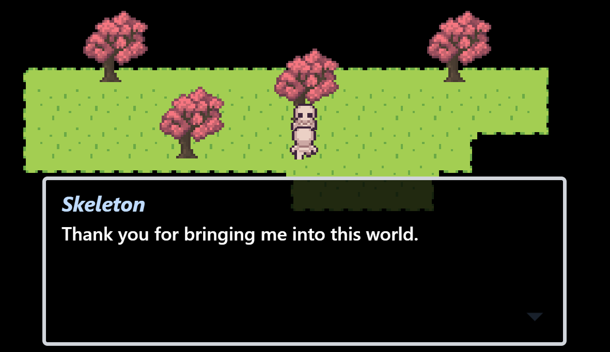

In this tutorial, we will create a simple story game with a map, dialog, and character. You can find the resulting project here! ADD_PROJECT_LINK

## Make a New Story Project

To get started, first we have to launch the editor and create a new story. After that, you will be put right into the editor!

## Creating Our First Map

Right now our story doesn't have any maps. Create a new map by clicking "Create new map." Now we're prompted to enter map information. Let's name our map "Hello World." We can leave our map tile size at 16px.

Head over to the edit map section. You'll see that there are no terrains. Let's use the following image as the source for our terrain.


_Hint: right click image to copy it from browser._

Click add terrain, then paste or drop in the terrain source image. You should see a preview for the terrain. That is how it will look when used in the map.

_Hint: You can add different terrain source layouts by selecting the mode._

Add this terrain. Now we see it in the list of terrains. Select that terrain and draw into the map! Let's add a nice looking road.



## Adding Map Objects

Our map feels rather empty now... With just a road and no trees or rocks. Let's add those objects in! Head over to the objects subsection and click "Add object." Paste or drop in this tree sprite.



There are options to configure this object, but we can leave it as is for now. Add the object and now we can select it to place them in the map!

_Tip: you can change the grid snapping options within the toolbar._



## Setting Player Sprite

Our story's player actor is currently occupied by a ghost... His name is Ghosty, and he is the fallback sprite for any actors without defined animations. Let's change our player character by adding a new animation. Head over to _Game assets > Animations_

We'll see that there aren't any animations right now. Click "Add animation" and paste or drop the sprite sheet below. Set the frame width and height to be 32px. Set the frame rate to 6 frames per second. Let's name it "Skeleton walk left."

Walk right:


Now head over to _Game assets > Actors_. Click on the player actor and set their walking left animation to the one we just added. Use the arrow keys to walk in the game and you should see the animation update!

Without any other animations set, the actor will infer the other directions. We can add the other animations for walking right, up and down.

Walk right:

Walk up:

Walk down:


## Our First Dialog Event

With our map ready, let's add a dialog event! Navigate to the `Events` section in our map. Add an event and select the `Dialog Event`. It will be the first in the list. The event may take a few seconds to load, which is normal.

Within the event configuration, we'll see a big text area for dialog. In Pixel Stories, dialog is written in a specific format. For this tutorial, copy the following into the text area.

```
Hello World
This is written into the dialog box!
```

Each line within the text area is a new dialog box in the game.

Now let's head back to the map and to the `Play test` section. Click `Start map events` and we'll see the dialog we've written. Woohoo!

## Adding First Character

Our game is missing some a character. In this section we'll add a character into the game.

Navigate to `Game assets > Actors` and add a new actor. We'll see that the configuration is missing animations. We could add another set of animations for this new character, but to save some time, let's use the same ones as the player. Name this character "Joseph."

Head back to our map. In the `Events` section, add the `Spawn actor` event. Select the actor to spawn as `Joseph`. We will set the spawn position by clicking on `Set position`, and click on a point next to the player. Now we're done configuring and ready to play test!

Head over to the play test section and we'll see the character spawn in after the dialog event plays.


## Interact With the Character, and They Run Away…

Now that we have a character in the game, the possibilities are endless! But let's stick to something simple: interacting with the character, playing some dialog, then moving away.

Navigate to the `Events` section of our map. Within the `Event groups`, add a new event group. We can rename it to "Skeleton talks." Add a `Dialog event` to this event group. We'll add the following dialog:

```
[Skeleton]
Hello friend!
Thank you for bringing me into this world.
I'd like to check out this tree.
```

The word within the bracket adds a name for the dialog. The name will display in the dialog box until it is changed or reset with empty brackets `[]`.

Now we will add another event, `Move actor`. Again, select `Joseph` and we can set the path for the actor. Click on `Set move path` and click to add points in the map where the actor will walk to. The actor will walk to the first point, then the next, and so on. For this event, let's set the character to walk to the tree.



Once the dialog and move actor events are set up in the event group, we can add the event group in our initial events list. The initial events list is what runs when the map first loads.

In the `Events` section, add the `Add event group` event. Select the event group `Skeleton talks` which we've just added. We can leave the instance name empty for now.

Set the trigger type to `Interact` and put the trigger position where our character spawns in the map.



Now we're done configuring this section and ready to play test! Head over to `Play test` and try pressing the action button `x` where the character is. We'll see the sequence play out.



## Advanced Tutorial

Thanks for going through this basic tutorial! We've gone through creating our map with terrain and objects, adding animations and actors, as well as a bit of the event system.

To learn more powerful features in Pixel Stories, go through the [Advanced Tutorial](Advanced%20Pixel%20Stories.md). We'll be covering connecting two maps, adding a simple puzzle using variables and conditionals, and the approach for doing multiple endings.
