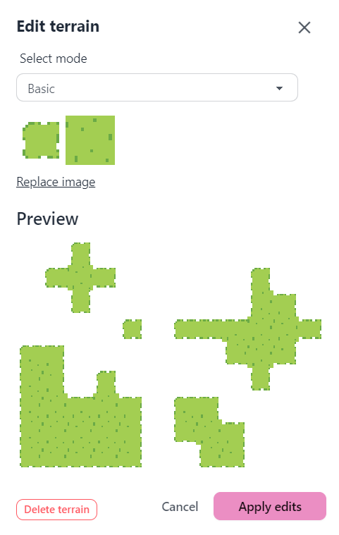
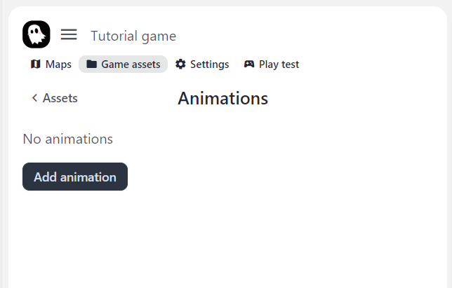
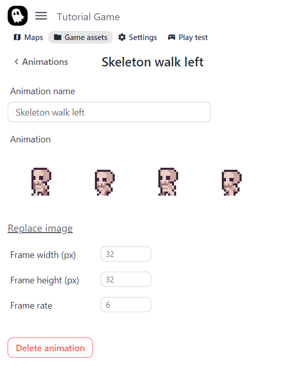

In this tutorial, we will create a simple story game with a map, dialog, and character. You can find the resulting project here! ADD_PROJECT_LINK

## Make a new story project

To get started, first we have to launch the editor and create a new story. After that, you will be put right into the editor!

## Creating our first map

Right now our story doesn't have any maps. Create a new map by clicking "Create new map." Now we're prompted to enter map information. Let's name our map "Hello World." We can leave our map tile size at 16px.

Head over to the edit map section. You'll see that there are no terrains. Let's use the following image as the source for our terrain. 

*Hint: right click image to copy it from browser.*

Click add terrain, then paste or drop in the terrain source image. You should see a preview for the terrain. That is how it will look when used in the map.

_Hint: You can add different terrain source layouts by selecting the mode._

Add this terrain. Now we see it in the list of terrains. Select that terrain and draw into the map! Let's add a nice looking road.

## Adding map objects

Our map feels rather empty now... With just a road and no trees or rocks. Let's add those objects in! Head over to the objects subsection and click "Add object." Paste or drop in this tree sprite.

There are options to configure this object, but we can leave it as is for now. Add the object and now we can select it to place them in the map!

_Tip: you can change the grid snapping options within the toolbar._

## Setting player sprite

Our story's player actor is currently occupied by a ghost... His name is Ghosty, and he is the fallback sprite for any actors without defined animations. Lets change our player character by adding a new animation. Head over to _Game assets > Animations_

We'll see that there aren't any animations right now. Click "Add animation" and paste or drop the sprite sheet below. Set the frame width and height to be 32px. Set the frame rate to 6 frames per second. Let's name it "Skeleton walk left."

The configuration should look like this:

Now head over to _Game assets > Actors_. Click on the player actor and set their walking left animation to the one we just added. Use the arrow keys to walk in the game and you should see the animation update!

Without any other animations set, the actor will infer the other directions. We can add the other animations for walking right, up and down.

## Your first dialog

## Adding first character

## Interact with the character, and they run away…

## Explore further: List of guides

- How to…
- How to…
