Our vision is to facilitate creativity and empower unique storytelling through video games. However, art and assets can be hard to come by! So we provide a range of default assets that can be used to build prototypes, proof of concepts, or serve as placeholders until your custom art is ready. 

## How to Use the Assets

1. **Download the Assets**: Navigate to the download section and get the assets you need.
2. **Import into Your Project**: Use the assets to create terrains, map objects, animations and characters. 
3. **Replace When Ready**: Assets in the engine can be easily swapped out for custom art once they're ready!

**Note:** 
Some assets have been made easy to import into Pixel Stories. However, if you are using the source tilesets or spritesheets directly:
- **Terrains from tilesets**: rearrange the tiles' layout so they are compatible with terrain import (RPG Maker, Wang layout, and so on).
- **Map object or animation from spritesheet**: use a drawing tool's rectangle select to copy and paste the section into Pixel Stories.

Feel free to reach out on [our Discord](https://discord.gg/XN9EaUh26g) if you have any questions or need assistance with using the assets. Happy developing!

## Asset Downloads

Find your assets and download specific asset packs or individual assets. 

### Zelda-like Tilesets and Sprites

This asset pack includes the following:
- Overworld tileset including castle, houses and some decoration
- Cave tileset
- Indoors tileset
- Character with sword animation and character template

**Credit:** "Zelda-like tilesets and sprites" by Armando Montero licensed [CC0 1.0 UNIVERSAL](http://creativecommons.org/publicdomain/zero/1.0/): [Source from Open Game Art](https://opengameart.org/content/zelda-like-tilesets-and-sprites)

**Download:** [Download all assets](https://api.pixelstories.io/storage/v1/object/public/misc/Zelda-like-tilesets-and-sprites.zip?t=2024-06-20T18%3A50%3A11.954Z)
#### Showcase
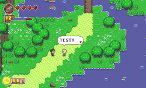

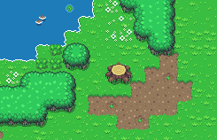

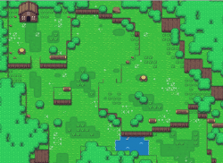

#### Wang tilesets

Select mode as Wang when importing these tilesets

*Hint: Right click to copy and paste into Pixel Stories import*

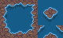
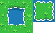
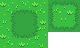

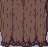
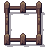
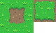
#### Characters

Walk down
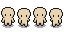

Walk right

Walk up
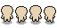

Walk left
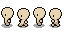

[Download all assets](https://api.pixelstories.io/storage/v1/object/public/misc/Zelda-like-tilesets-and-sprites.zip?t=2024-06-20T18%3A50%3A11.954Z)

---

More default assets coming!