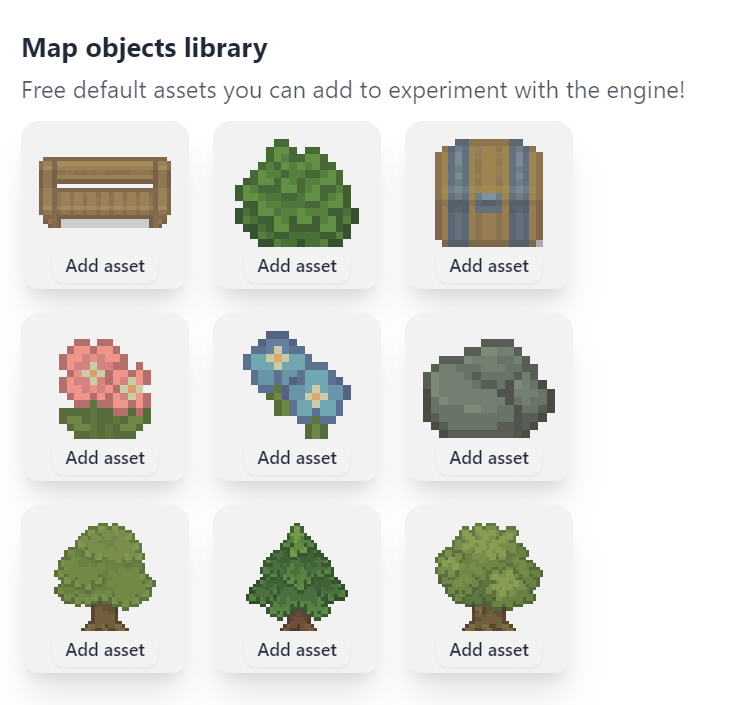

import { Steps } from "@astrojs/starlight/components";

Our vision is to facilitate creativity and empower unique storytelling through video games. However, art and assets can be hard to come by! So we provide some default assets that can be used to build prototypes, proof of concepts, or serve as placeholders until your custom art is ready.

Keep in mind, all assets in the engine are replaceable at any time. So don't feel locked in to a specific style!

## How to Use the Assets

<Steps>

1. In the game engine, navigate to map terrains or map objects
2. Click `Terrains library` or `Objects library`.
3. Add the assets you'd like.
   - Once added, you can immediately use them in your game.
4. Replace when ready.
   - Assets in the engine can be easily swapped out for custom art once they're ready.

</Steps>

### Using Assets From the Web

There are many websites which give free assets to use in your game, such as [Open Game Art](https://opengameart.org/art-search-advanced?keys=&field_art_type_tid%5B%5D=9&sort_by=count&sort_order=DESC) and [Itch.io](https://itch.io/search?q=Pixel+art+assets). However, not all art assets are in the right format to be put directly into the engine. You may need to do a bit of image formatting so it's compatible with the Pixel Stories engine.

- For terrains from tilesets, rearrange the tiles' layout so they are compatible with terrain import (RPG Maker, Wang layout, and so on).
- For map objects, use a drawing tool's rectangle select to copy and paste the section into Pixel Stories.
- Animations are in the format of single row sprite strips. If it's from a spritesheet, use a drawing tool to copy out the sprite strip row.

Feel free to reach out on [our Discord](https://discord.gg/XN9EaUh26g) if you have any questions or need assistance with using the assets. Happy developing!
