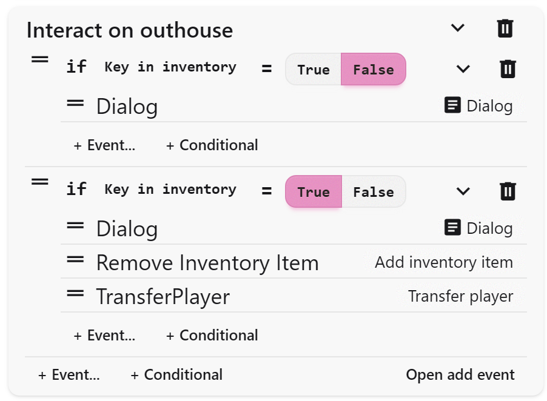

Conditional branches let your events respond to the player’s actions. They check variables or inventory and decide what happens next. If the condition is true, one set of events plays; if false, the events do not play.

## Common Uses

- Checking if the player has a key before opening a door
- Changing dialog if the player has already met an NPC
- Triggering different endings based on player choices
- Unlocking puzzles only if certain switches are active

## Variables

To use conditionals, you must first create variables in the **Assets** page. Variables cannot change type once created. Types include:

- **Switch:** On or off (true/false)
- **Number:** Any numeric value
- **Text:** A string of characters

Update values with the **Set Variable** event. Clear names like `hasKey` or `metNPC` help keep track as projects grow.

:::tip
Name variables clearly so you can find them later. Conditions run in sequence, so be careful that one branch does not accidentally make another branch below activate.
:::

## Adding a Conditional

Click **+ Conditional** in the event list. Add your condition, then place events inside each branch. Conditions are tested in order, so the first true condition runs its events.

You can check for:

- **Switch variables:** True or false values
- **Number variables:** Greater, less, or equal to a number
- **Text variables:** Matches specific text
- **Inventory items:** Whether the player has or does not have an item
