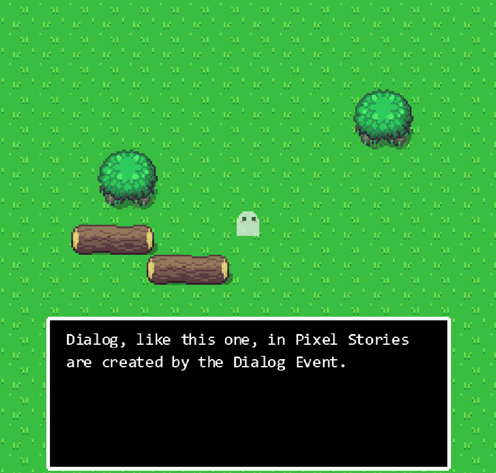
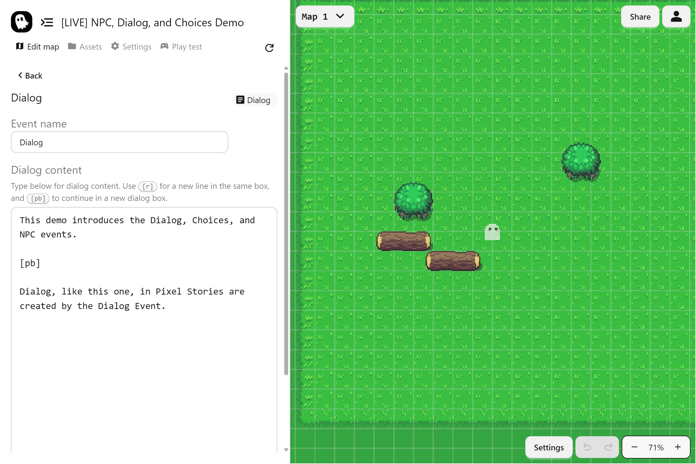

The Dialog event is used to show text to the player inside a dialog box. It delivers story, instructions, or character speech during your game. You control the content, style, and flow of the text, while PS Maker handles how it appears on screen.

## The Dialog Event

The **Dialog** event opens a dialog box and displays text for the player to read. You write your lines in the text area, then the game shows them during the event sequence.

### Adding Dialog

To add dialog, click **+ Events…** and select the **Dialog event**. Then within the event config, enter your dialog into the text box.

### Inline Tags

Dialog supports inline tags to control flow:

- **`[r]`**: Continue on a new line in the same dialog box
- **`[pb]`**: Continue in the next dialog box (page break)

Overflow is handled automatically. When text is too long, it moves to the next box.

### Styling With BBCode

The dialog box supports **BBCode** for emphasis and readability, for example bold, italics, and color.

- Keep styles consistent across your project
- Use emphasis for important names, clues, and items

See the **[BBCode Guide](https://www.bbcode.org/reference.php)** for supported tags.
