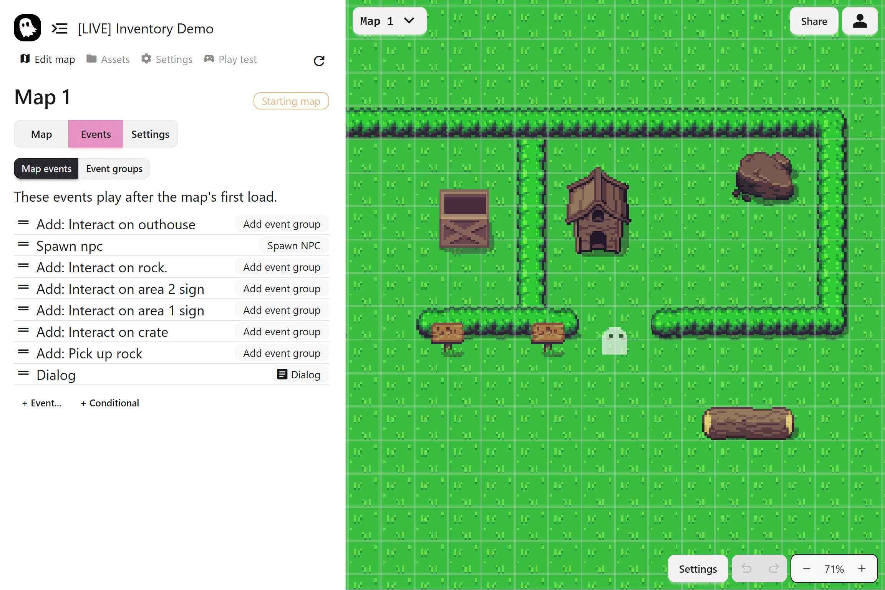
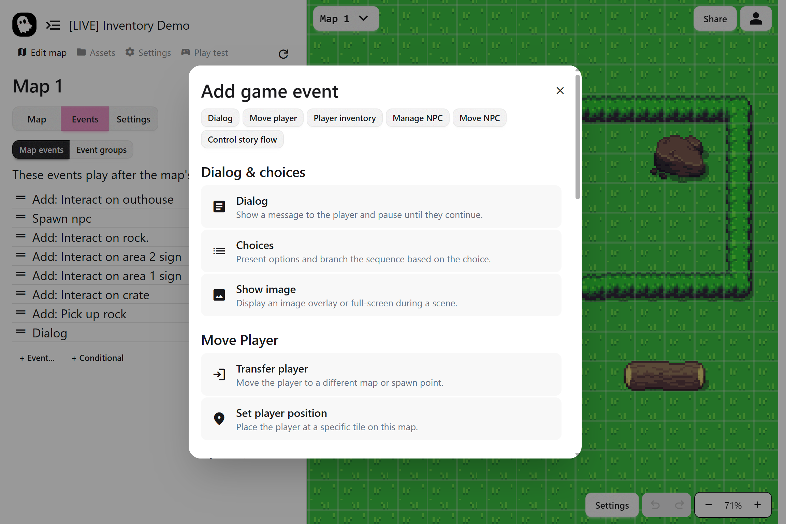

The **Events Editor** is where you turn ideas into gameplay. You add events, set their options, and the game plays them in order. Use it to create dialogue, choices, map changes, puzzles, and more.

## What Is an Event

An **event** is a single action the game can perform. Examples include showing dialogue, presenting choices, moving the player, spawning an NPC, or switching maps. You combine events to build complete game mechanics in your story.

### What's Possible

There are limitless ways to use events in your story. Below are some examples:

- dialogue and choices for story scenes
- Doors or portals that transfer the player to other maps
- NPC movement, patrols, and chase sequences
- Puzzles or quest mechanics using inventory items

### Where Events Run

There are two places where events go:

- **Map Events:** Events that run when a map first loads
- **Event Groups:** Reusable events that run together when triggered in the map

Map Events are great for setup, intros or cutscenes. Event Groups handle interactions that the player can activate during gameplay.

## Adding Events

Click **+ Events…** to open the event menu, then choose your event. After adding an event, configure its settings in the panel on the right. Events play from top to bottom unless a branch changes the flow.

## Next Steps

Events are the foundation, but by themselves they only create linear sequences. To make your game dynamic and engaging, you need to combine them with **event groups** for interactivity and **conditional branches** for choices and branching stories. These tools take your events from simple actions to full gameplay mechanics.

- [Event Groups and Triggers](./event-groups)
- [Conditional Branches and Variables](./conditionals)
- [dialogue and Choices](./dialogue-event)
- [Player Events](./player-events)
- [NPC Events](./npc-events)
- [Control flow Events](./control-flow-events)
