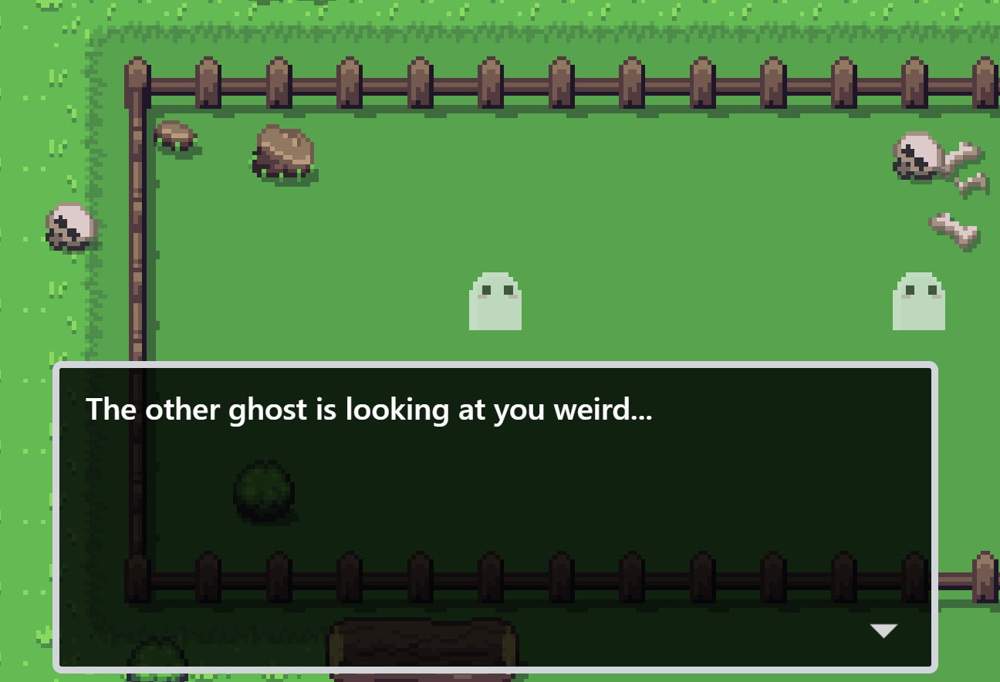

The dialog event shows text in a dialog box with in the game. It can be used with event groups to create dynamic narratives between characters in your game.

 

<pixel-art>

</pixel-art>

## Configuration

The configuration is as follows:

| Name        | Description             |
| ----------- | ----------------------- |
| Dialog text | The dialog text to play |

## Event Notes

Some important notes about the event are included below.

### Dialog Text Format

Dialog is written in a specific format:

- Each line within the text area represents a new dialog box in the game.
- The word within the bracket adds a name for the dialog. The name will display in the dialog box until it is changed or reset with empty brackets `[]`.
