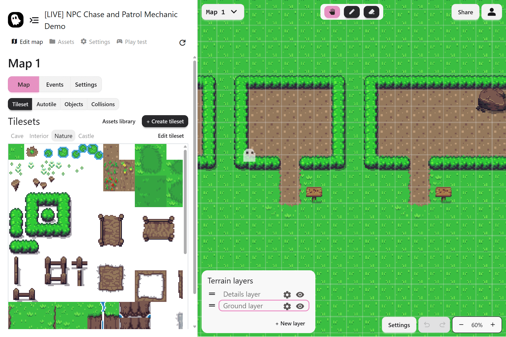
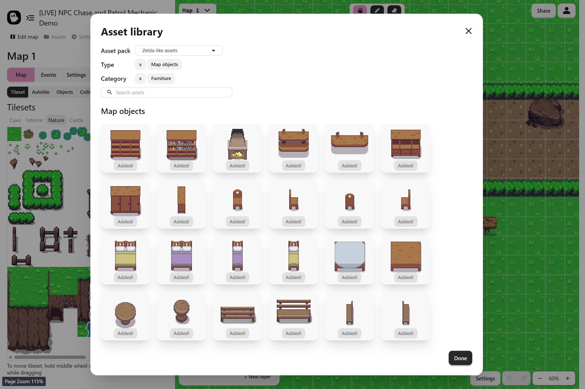

Pixel Stories gives you the tools to build story-driven games. Explore the core features below that make building your world and creating your story easy.

## A Focus on Storytelling

Pixel Stories takes care of the technical details so you don’t have to. Core systems like player movement and controls, collisions, layering, NPC systems are already handled for you. This lets you spend your time on what matters most: world building, character development, and telling stories.

## Map Editor

Build immersive maps visually with drag-and-drop tools. The Map Editor gives you everything you need to design your world:

- **Tilesets** to lay down grass, roads, and walls like puzzle pieces
- **Autotiles** that automatically fill in borders and corners for seamless terrain
- **Map Objects** such as trees, houses, and animated sprites, complete with depth sorting and collisions

## Custom Assets

Upload your own art, music, and sounds to make your game unique. You can import any tiles, sprites, animations, audio, or UI elements, giving your project a completely custom look and feel.
We also have a **free Asset Library** to help you start building right away, including ready-to-use tiles, objects, and terrains. Assets are open source and organized by category.

## Events System

Bring your story to life with events. Events are the building blocks of gameplay in Pixel Stories, letting you chain actions, dialogs, and mechanics into interactive sequences.

With events you can have:

- **Player Interactions**: Set up interaction or touch triggers with event groups, allowing for dynamic and immersive gameplay
- **NPC Control**: Spawn NPCs, set animations, create patrol routes, and trigger chase sequences or interactions
- **Player Control**: Transfer the player between maps, set their location, or teleport them during cutscenes
- **Branching Stories**: Check variables, inventory items, or switches to create branching paths and multiple outcomes

## Dialog and Choices

Show dialog boxes with styled text, paging, and offer choices to the player that shape the story.

Customize the look and feel of your dialog boxes to match your game’s style. You can adjust background and border colors, fonts, text size, alignment, and even the way text appears (typewriter, fade-in, wavy, or instant).

## Inventory System

Add items the player can collect, use, or need to unlock events. Great for puzzles, locked doors, and quest items.

## Game Mechanics

Combine events, NPCs, and inventory to design the gameplay that fits your story. Pixel Stories gives you the flexibility to create mechanics such as:

- **Fetch Quests:** Require the player to collect an item and return it to an NPC or location
- **Chase Sequences:** Trigger NPCs that pursue the player until they escape or are caught
- **Patrols and Stealth:** NPCs follow looping paths, creating sneaking or timing challenges
- **Locked Doors and Keys:** Use inventory items or conditionals to restrict access until the player has the right item
- **Puzzles:** Switches, variables, and events can be combined for logic-based or item-based puzzles
- **Branching Storylines:** Choices and conditionals allow for multiple outcomes and endings
- **Cutscenes:** Use dialog, camera movements, and NPC actions to stage story moments
- **Shops and Trading:** Add and remove inventory items to simulate shops or exchanges
