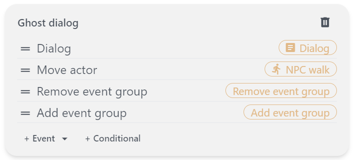
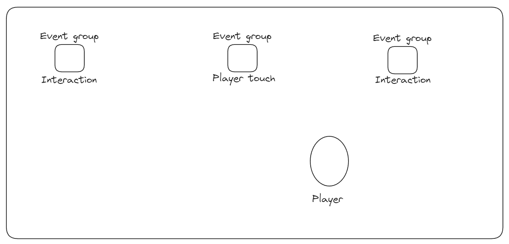

The event system in Pixel Stories is a powerful and flexible tool that enables developers to create dynamic and interactive gameplay experiences. Events are the core mechanisms through which the game world responds to player actions, drives the narrative, and adds interactivity.

## Events in Pixel Stories

The following are the current Pixel Stories events divided into the following categories:

- **Essentials**
  - Dialog
  - Timer
- **Player**
  - Transfer player
  - Set player position
- **Actors**
  - Spawn actor
  - Remove actor
  - Move actor
- **Control flow**
  - Add event group
  - Remove event group
  - Set variable
- **Music/sound**
  - Play sound
  - Set background music
  - Stop background music

### How Events Work

Events are the building blocks that control what happens in your game. When a player first enters a map, the map runs the initial set of events. These events can include actions like showing a dialog, moving an actor, or starting a wait timer.

### Event Groups

Event groups are a group of events separate from the map's initial events.

Example Event Group:

### How Group Events Work

The map's initial events play one after another when the map loads. To play the event group's events, we must add it to the map with the `Add event group` event. When it's time to remove the event group from the map, we can use the `Remove event group` event.

When an event group is added with the `Add event group` event, they can be triggered via:

- `Interact`, the player is next to event group and presses `Enter` or `X` to trigger it.
- `Touch`, the player walks up to the event group tile.
- `None`, event group plays immediately when added.

Imagine a map having many event groups. With this system, it's possible to build puzzles, dynamic interactions, and interesting story game mechanics.

The follow is a sketch of a map which has several event groups added in:

:::note

An event group's events will never play until they are added into the map with an `Add event group` event!

:::

## Table of Events

Below is the table of all the current events and a brief description:

| Event Name            | Description                                              |
| --------------------- | -------------------------------------------------------- |
| Dialog                | Create and manage conversations between characters.      |
| Timer                 | Trigger actions after a set time interval.               |
| Transfer player       | Transfer the player to a different map                   |
| Set Player Position   | Change the player's location within the map.             |
| Spawn Actor           | Introduce new characters or objects into the game world. |
| Remove Actor          | Remove characters or objects from the game world.        |
| Move Actor            | Control the movement of characters or objects.           |
| Add Event Group       | Bundle multiple events into a sequential group.          |
| Remove Event Group    | Delete a previously defined group of events.             |
| Set Variable          | Modify game variables to influence gameplay.             |
| Play sound            | Plays a sound                                            |
| Set background music  | Set the background music to a music track                |
| Stop background music | Stop the background music if any is playing              |
