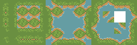
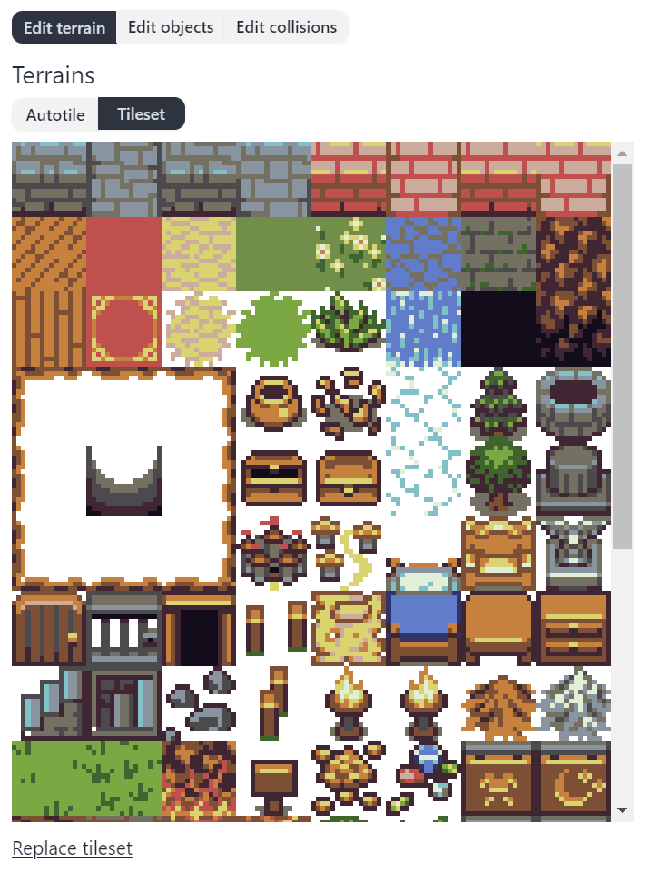

Game Assets in Pixel Stories is designed to help users effectively manage all types of game assets. Game assets include images, animations, actors, sounds/music, and variables.

Uploading assets into Pixel Stories is designed to be simple. Each asset is individually uploaded into the game engine and always replaceable.

## Map Terrains

Auto tiling works by creating map terrains in Pixel Stories. Each map has a defined tile size. The tile size can be any size (i.e. 16px, 32px, 48px, 64px, even 12px). The tilesets used in the map must use the same tile size. For instance, a 32px tile size map should only use 32px tilesets to create terrains.

### Auto-tile Terrains Format

In Pixel Stories, terrains are created by providing a source tileset and selecting the format. Below are the three formats, each with a template and an example:

 

<pixel-art>

**RPG Maker**

**Wang**

**Blob**

</pixel-art>

### How do I use the auto-tile templates?

In the auto-tile template, the light gray areas represent the interior of the terrain, and the dark gray areas outline the borders. The darkest gray areas mark the corners of the border. When transformed into an auto-tile, these corners will connect to form a continuous border around the terrain.

**Note:** In RPG Maker, the first tile doesn’t affect the terrain, as it’s only a thumbnail.

### Wang, Blob, or RPG Maker format?

Choosing between Wang, Blob, or RPG Maker formats ultimately depends on your needs. All three formats produce the same result, an auto-tile terrain. They exist to make importing existing assets easier. If you’re starting from scratch, go with the format you feel most comfortable drawing in. Otherwise, use the one which is the easily rearrange your tileset into.

### Single Tile Placement

The "single tile tileset" allows you to place individual tiles on the map. This is useful for adding non-autotile details, such as staircases, rocks, signs, and variations in terrain. It also simplifies terrain filling; for example, you can use single green tiles to fill a grass interior within a water-bordered autotile.

Single tile placement is designed to keep your game organized and scalable. Start by adding only the tiles you need in one tileset and then expand to the right and down as your game grows. This way, you can add tiles incrementally as your game grows.

## Animations

Pixel Stories supports player and character animations through sprite strips.

### Sprite Format

To import animations, they must be in the format of single row sprite strips. Such as the one below.

<pixel-art>

</pixel-art>

If you asset came in a spritesheet grid, you can use a spritesheet editing tool like [EZGif Spritesheet cutter](https://ezgif.com/sprite-cutter) to slice the spritesheet into rows.

The engine does not currently support animations that come in a GIF format. To use a gif, [EZGif gif to spritesheet](https://ezgif.com/gif-to-sprite) can convert to a sprite strip.

## Audio and Images

Audio and images can also be imported into your game in Pixel Stories.

### File Types

Since our game engine is web-based, we can automatically support a wide range of file types. The following are what's supported.

**Audio:**

- .ogg
- .mp3
- .m4a

**Images:**

- .png
- .jpeg
- .svg
- .webp
