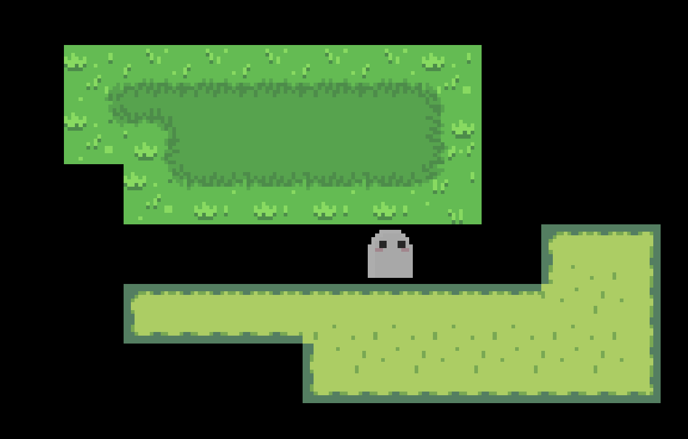
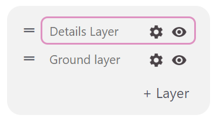
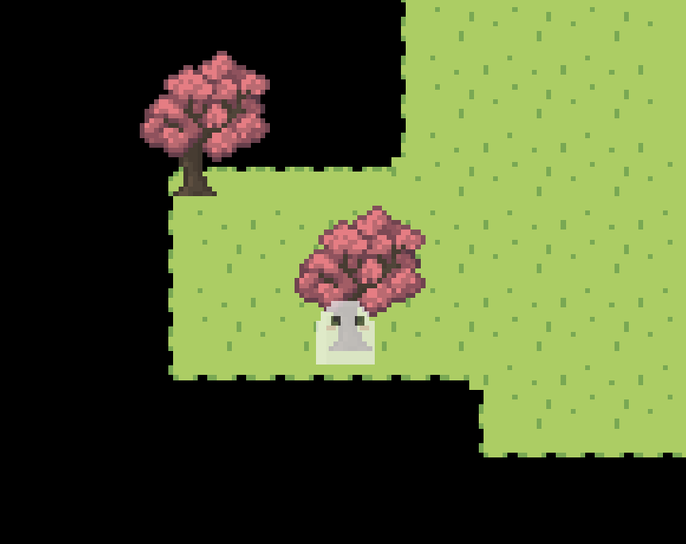
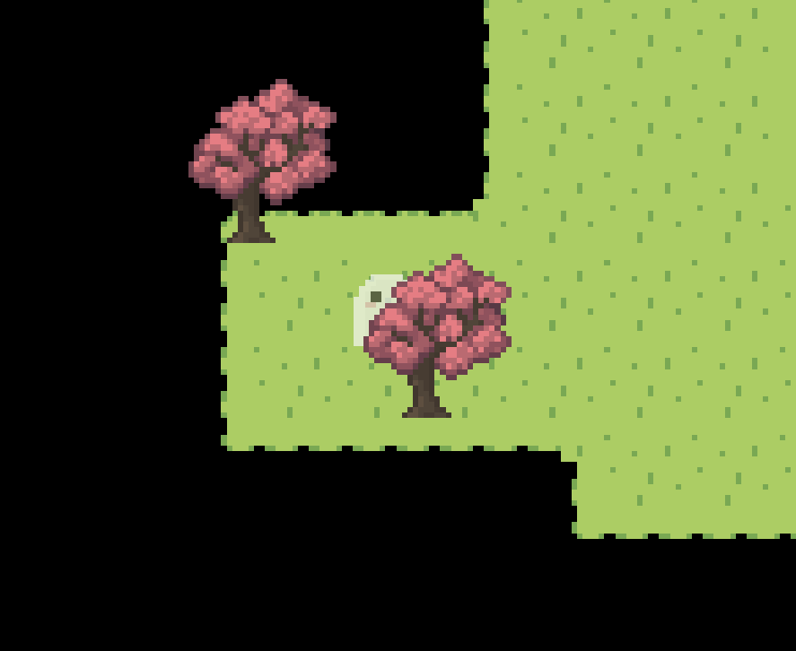
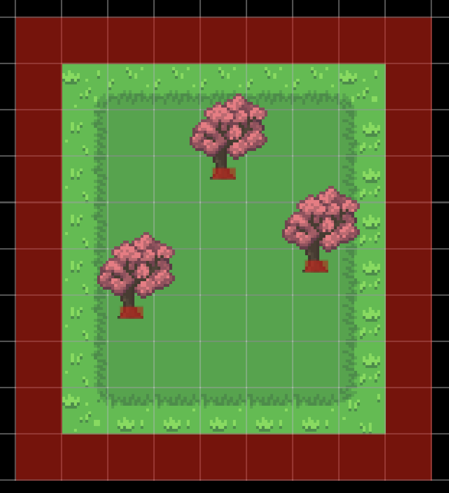

The following sections explain how the map editor in Pixel Stories works. The key features include terrains, auto tiling, terrain layers, map objects, and collisions.

## Terrains

In Pixel Stories, terrains are created by providing a source tileset and selecting the type. You can find more about how to import terrains from tilesets in the [Game Assets Doc](/features/game-assets/#map-terrains).

### Auto Tiling

Once you've created a terrain, the terrain can now be drawn into the map! The auto tiling will determine how each tile connects with its neighboring tiles.

### Terrain Layers

Our terrain layers allow you to have full control of your layers for your map. This gives you a lot of freedom, but the following is a structure we found to work will in organizing your layers.

1. Details Layer: Use this layer for details like small plants, rocks, or for adding variety to ground tiles.

2. Ground Layer: This is where the main tiles for terrains, walking surfaces, floors, and walls.

**Note:** All terrain layers will sit below the player. For any tiles which the player should be able to walk behind (trees, large rocks, houses), add them as [Map Objects](#map-objects).

## Map Objects

Map objects are a separate entity from map terrains. They are able to be placed anywhere on the map, not forced to sit on a particular tile, They are also whole sprites, not built up from multiple single tiles.

Map objects have depth sorting automatically handled, so the player properly goes in front and behind objects accordingly.

In the example below, you can see the ghost player can be both behind and infront of the tree.

## Collisions

The way Pixel Stories handles collisions is by simply drawing collision boxes into the map.

In the example below, the player is bounded within the box and cannot walk right through trees.

