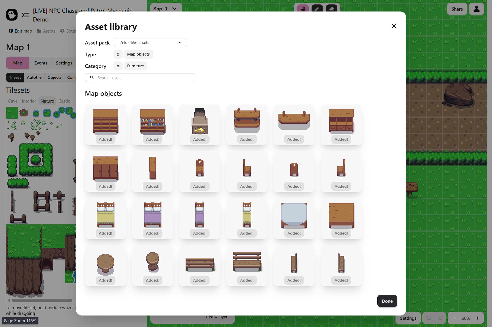

The **Asset Library** gives you ready-to-use content so you can start building maps without creating everything from scratch. It includes tilesets, autotile terrains, and map objects.

## Where to Access

You can open the Asset Library directly from the Map Editor:

- **Edit Map > Tilesets** Add terrain tiles
- **Edit Map > Autotiles** Add autotile terrains
- **Edit Map > Objects** Add map objects

The library has a large collection of assets, so everything is sorted into categories with clear, descriptive names. This makes it easier to find what you need for your project.

## Licensing

All assets in the library are taken from open source game art and are licensed under **CC0**. You are free to use them in your games, and credit goes to the original creators.
