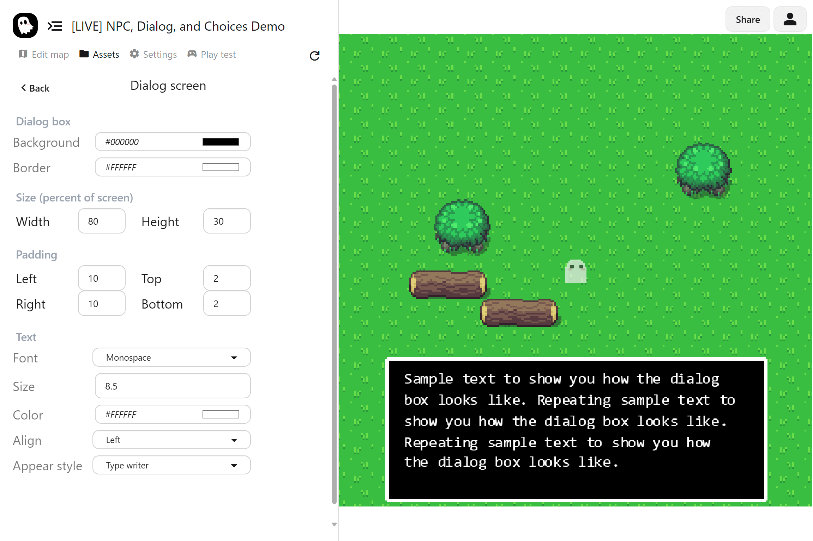

The **dialogue UI** controls how text appears to the player. You can customize its look and style to match your game’s theme.

## Customization Options

| Setting              | Description                                                     |
| -------------------- | --------------------------------------------------------------- |
| **Background color** | Choose the fill color of the dialogue box                       |
| **Border color**     | Change the outline color of the dialogue box                    |
| **Size**             | Adjust the width and height of the dialogue box                 |
| **Padding**          | Set spacing between text and the box edges                      |
| **Font**             | Pick the typeface used for dialogue text                        |
| **Text size**        | Change how large the dialogue text appears                      |
| **Text color**       | Choose the color of dialogue text                               |
| **Alignment**        | Align text left, center, or right                               |
| **Appear style**     | Control how text appears: typewriter, fade in, wavy, or instant |
