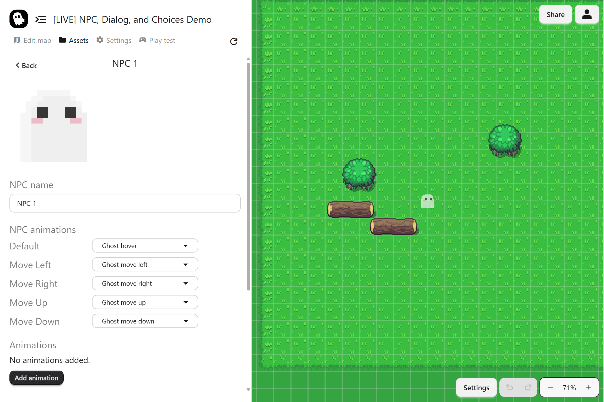

NPCs are characters you define in the **Assets** page. They can be spawned into your game with the **Spawn NPC** event and controlled with animations and events.

## Steps to Add a New NPC

1. Open the **Assets** page and go to **NPCs**
2. Click **Create NPC**
3. Give the NPC a clear, descriptive name
4. Add the NPC’s animations using sprite strips
5. Configure global animation settings, then adjust per-animation settings if needed

## Animations

NPCs support both idle and movement animations. Animations use **sprite strips**, which are frames laid out in a row. You can also set an idle animation to a single frame if you want an NPC with no animation.

Each NPC has **global animation settings** that apply to all of its animations, as well as per-animation settings for fine tuning. This saves time since most animations for a character share the same frame setup.

You can add more animations to an NPC and switch between them during gameplay using the **Set NPC Animation** event.

## Other Uses

NPCs are not only for characters. You can also use them creatively as interactive objects, such as items the player can pick up.

## Learn More

To control NPCs once they are in the game, see the [NPC Events](../event-system/npc-events) doc.
