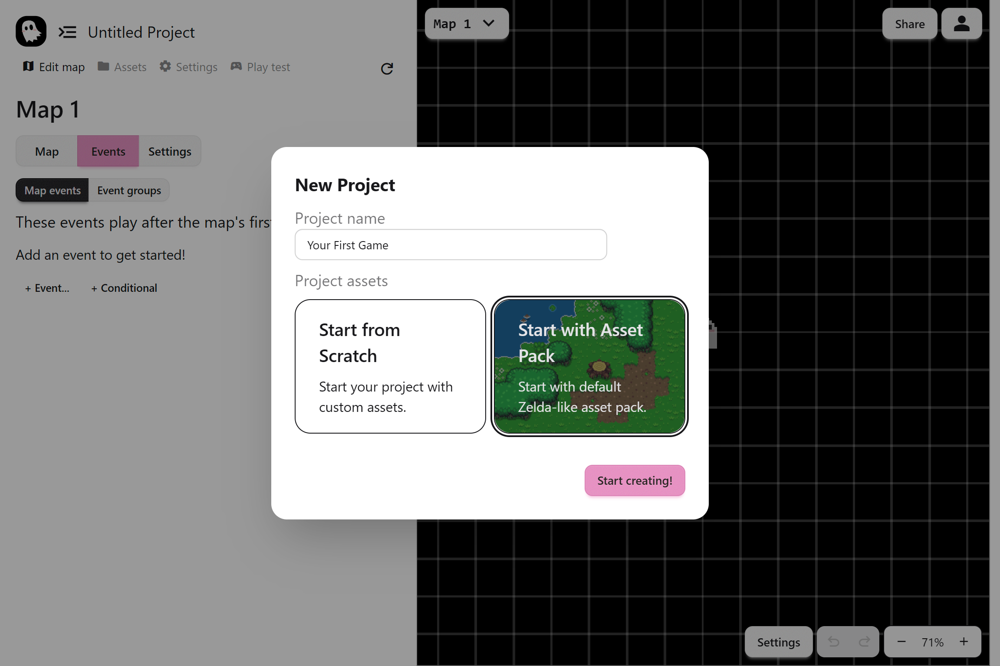
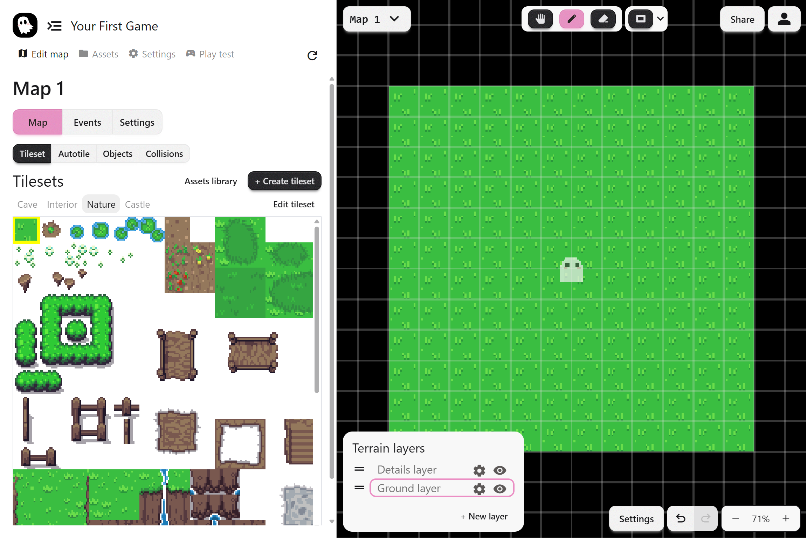
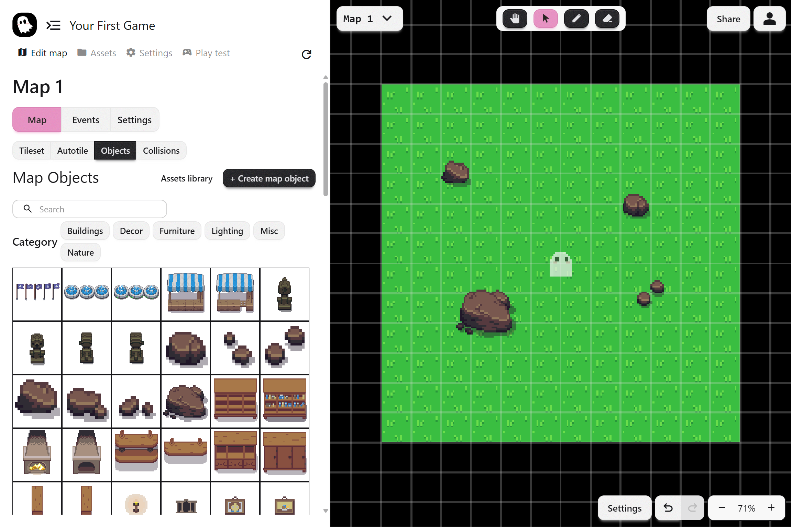
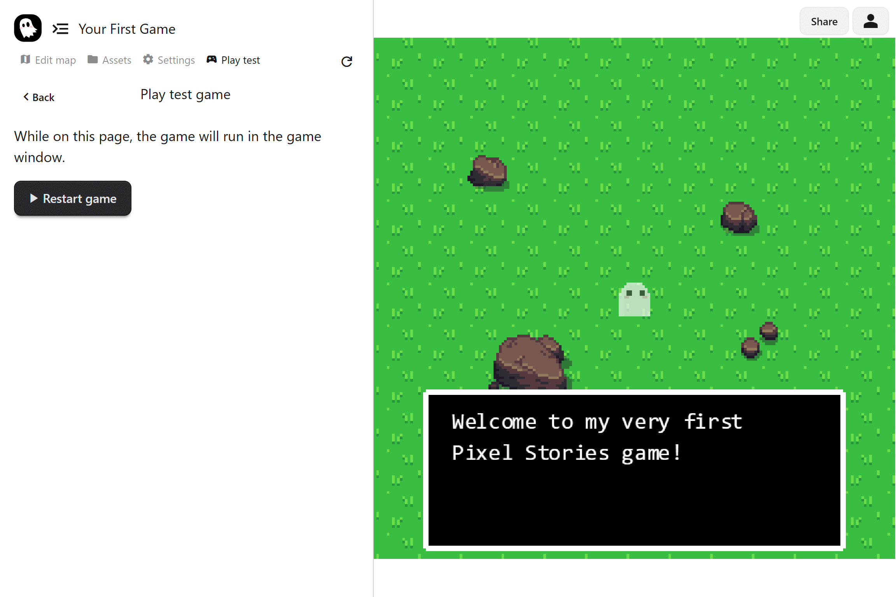
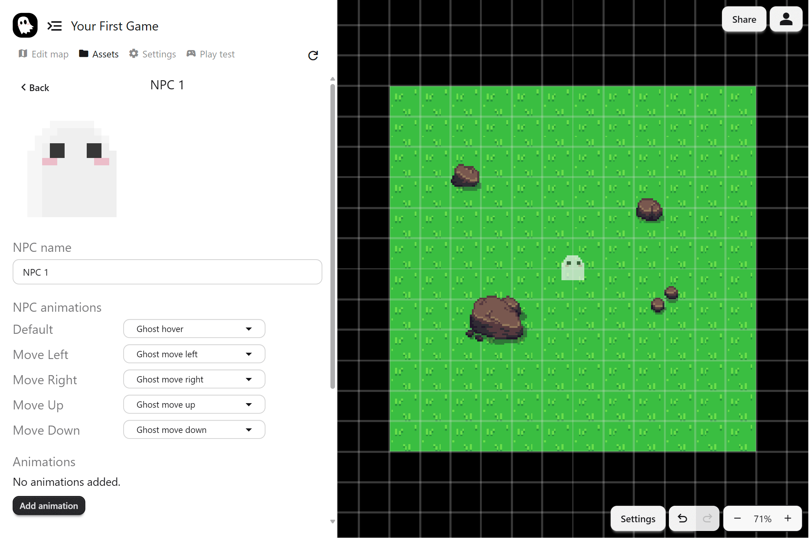
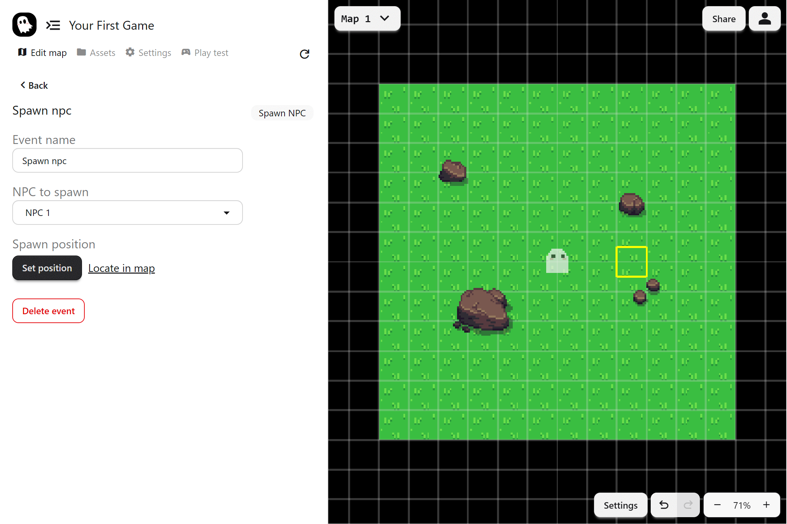
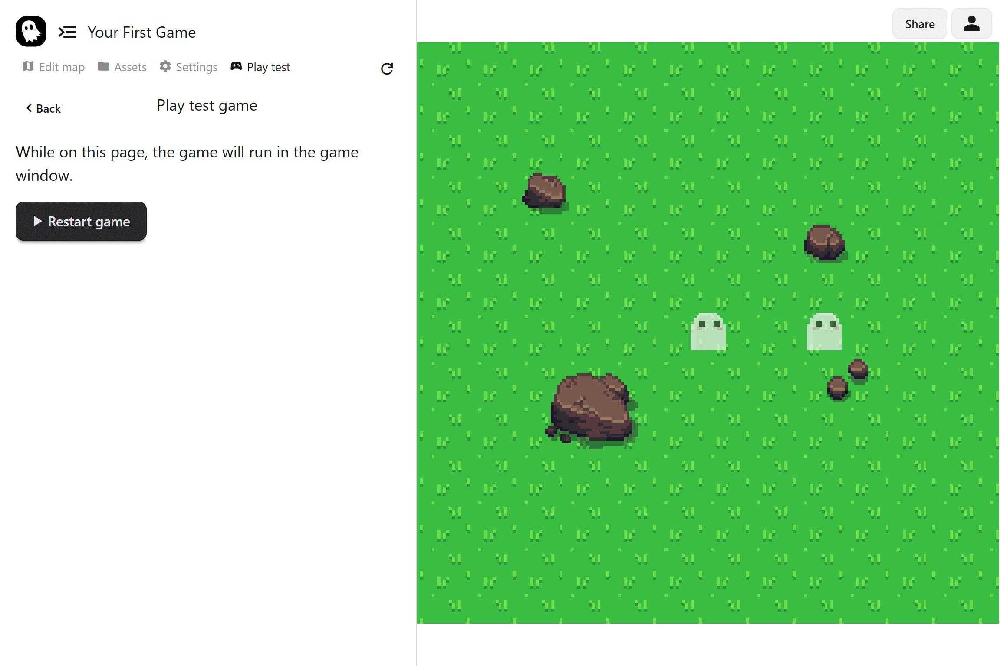
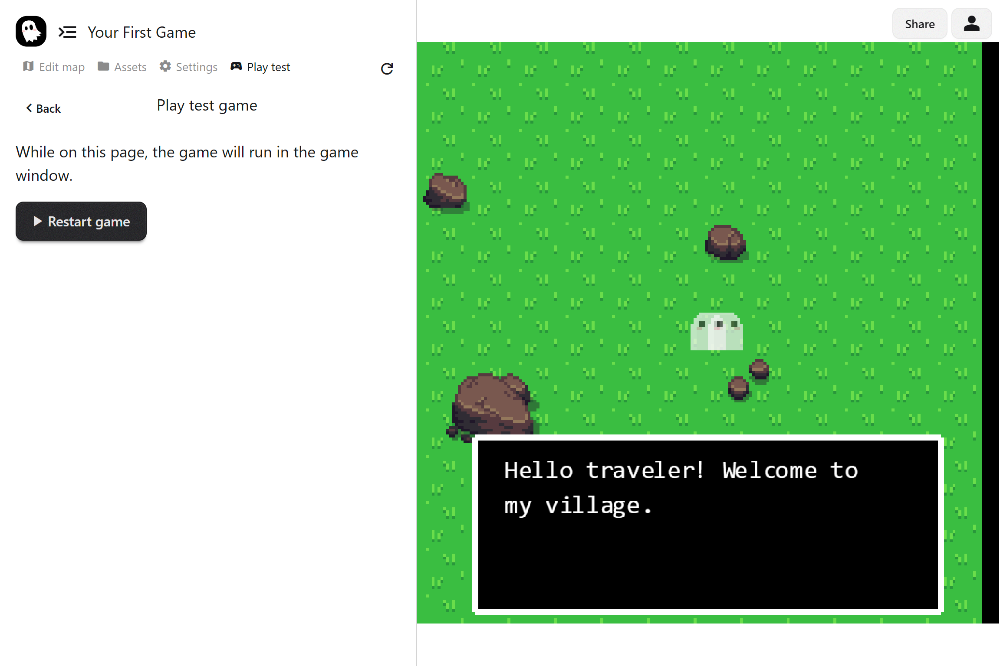

import { Steps } from "@astrojs/starlight/components";

We’ll build a simple game from scratch. By the end of this tutorial you’ll have:

- A decorated map
- An intro dialogue message
- An interactable NPC that talks back

<iframe
  width="560"
  height="315"
  src="https://www.youtube.com/embed/ei-jbw32Ino?si=2sgMmce-xJ4Acvio"
  title="YouTube video player"
  frameborder="0"
  allow="accelerometer; autoplay; clipboard-write; encrypted-media; gyroscope; picture-in-picture; web-share"
  referrerpolicy="strict-origin-when-cross-origin"
  allowfullscreen
></iframe>

## Project Setup

First, let’s set up your project.

1. Open the <a href="https://app.pixelstories.io/" target="_blank">PS Maker editor</a>
2. Create an account.
3. Create a new project, with default asset pack.



## Building a Map

A game needs a world. We’ll create a small starting map using the built-in assets.

### Draw the Terrain

1. Go to **Edit Map > Tilesets**.
2. Select the grass tile.
3. Select the rectangle shape, and paint the ground of your map.

The top toolbar is where you'll find all the tools for the tab you are on. Right now, we see the tileset draw and erase tools.



:::tip
Use [autotiles](../map-editor/autotile) for borders if you want patches of dirt or paths.
:::

### Place Objects

1. Switch to **Edit Map > Objects**.
2. Select a rock and add a few into the map.

Similar to the tileset tools, you can find the map object tools. Besides place and erase, you'll also find a select tool that can move the objects around.



## Your First Event

Before we add NPCs or interactions, let’s try a simple dialogue event. This will show a message as soon as the map loads, so you can see how events run in sequence.

### Add a dialogue Event

1. Go to **Events > Map Events**.
2. Click **+ Events…** and select **dialogue**.
3. In the text box, type a short message, for example:

```

Welcome to my very first PS Maker game!

```

4. Go to the **Play test** page. As soon as the map loads, the dialogue will appear.



## Adding an NPC

Next we’ll add a character who can speak with the player.

### Create an NPC

1. Go to the **Assets > NPCs** page.
2. Click **Add NPC**.
3. Name it **"Ghost friend"**
4. Set each movement animation to the default ghost animation.



### Spawn the NPC

1. Go back to the **Edit map** page.
2. In **Events > Map Events**, add a **Spawn NPC** event.
   <br /> You'll find it under the **Manage NPCs** section
3. Select **"Ghost friend"** as the NPC to spawn
   <br /> Click to set a position on the map.

When you run the game from the **Play test** page, the NPC will appear.





## dialogue With the NPC

We’ll make the NPC speak when the player interacts.

### Create an Event Group

1. Go to **Events > Event Groups**.
2. Create a new group called `Talk to Ghost friend`.
3. Add a **dialogue** event with some text, for example:

```
Hello traveler! Welcome to my village.
[pb]
It’s dangerous to go alone...
```

The special tag `[pb]` continues the message in a new dialogue box.

### Add the Trigger

1. Back in the event group, click on **Add to map**.
   <br /> This adds an event to put the event group into the map.
2. Set the trigger to **Interact**.
3. Set the trigger position to **Attach to NPC**, and onto **"Ghost friend"**

Now, in the **Play test** page, when you walk up to the NPC and press **Enter** or **Z**, the dialogue will play.

:::tip

1. It's important to for the event group to **attach to NPC** so if the NPC moves, the
   event group will stay with it.

2. Events run one after another. Make sure events that use an NPC run after the NPC spawn event!
   :::



## Sharing Your Game

Click **Share** at the top right to copy a link. Send it to friends so they can play your creation instantly in their browser.

## What’s Next?

You now know the basics of maps, NPCs, and events. From here, the fun begins!

The rest of the docs has a lot of good information. Try building more maps, playing with the event system, and seeing how different mechanics come together. The more you experiment, the more you'll discover what possible in PS Maker.

Here are a few good next steps:

- [Tilesets](../map-editor/tilesets): Add terrain and shape the foundation of your world
- [Autotiles](../map-editor/autotile): Speed up map design with smart borders and corners
- [Event System](../event-system/events): Learn how to create dialogue, choices, and gameplay mechanics
- [NPCs](../game-assets/npcs): Bring characters to life with animations and interactions

Have fun building maps, exploring the event system, and creating stories that are uniquely yours!

Join our [Discord community](https://discord.gg/WTxUC4hEnS) if you’d like help or want to share what you’ve built!
