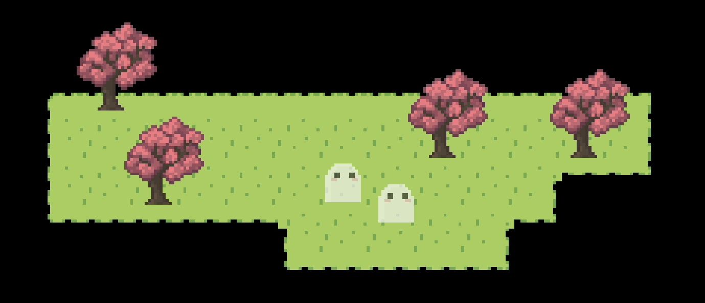

import { Steps } from "@astrojs/starlight/components";

This tutorial will get you familiar with the engine's interface and basic tasks. It covers creating a map with terrain and objects, adding animations and actors, as well as a bit of the event system.

### Project Set-up

To get started, first we have to launch the game engine and create a new story.

<Steps>

1. Login to Pixel Stories.
2. Create a new project.
3. Name our project "Intro Tutorial."

</Steps>

Once you login, all edits in your game are automatically saved. You can access your project and work on them on any browser!

:::tip[Auto-save]

All your progress is always automatically saved!

:::

### Drawing the Map

In this tutorial, we'll create our first map. You can find the assets we use below:

<a
  href="https://api.pixelstories.io/storage/v1/object/public/misc/Basic_Tutorial_Assets.zip"
  download
>
  Download the tutorial assets here.
</a>

#### Adding a Map

Right now our game is blank because it doesn't have any maps. Let's add our first map.

#### New Map

<Steps>

1. Navigate to `Maps` tab.
2. Click `Add map` to create a new map.
3. Name the map "Map 1."

</Steps>

We can leave the map's tile size to be `16px by 16px`.

#### Terrains

To draw into the map, we first have to add a terrain. A terrain is an auto-tileset generated by a source tileset. We'll be adding the source tileset below.

<Steps>

1. Navigate to `Edit map > Edit terrains` section.
2. Click `+ New terrain` to add a new terrain.
3. Upload the following asset.
   <pixel-art>
   
   </pixel-art>
   _Right click image to copy or save it from browser._ <br/>
   You should see a preview for the terrain. That's how it will look when used in the map.

4. Add the terrain.

</Steps>

To draw into the map, select the terrain and click in map to draw. We can use the editing
tools in the tool bar on top of the game window to pan, draw, and erase.


:::note[Map Terrains]

Learn more about adding different types of terrains at [map editor terrains](/features/map-editor/#terrains).

:::

#### Map Objects

Our map feels rather empty now... With just some land and no trees. Let's add in some trees!

<Steps>

1. Navigate to `Edit map > Edit objects` section.
2. Click `+ New object`.
3. Upload the following tree sprite asset.
   <pixel-art>
   
   </pixel-art>
4. Add the object.

</Steps>

To place the object in the map, select the object and use the drawing tool to place into the map. If we want to erase an object, we can use the erase tool.

:::note[Editing Objects]

Make sure you are under the `Edit map > Edit objects` tab while drawing or erasing map objects.

:::


Now we can try testing the game. Navigate to the `Play test` tab. Click into the game and you can use the `arrow` or `WASD` keys to walk around. The ghost in the screen you see is the player character.

#### Map Collisions

You'll find that the play can walk anywhere in the game, include outside of the terrain we drew. To keep our player in the map, we must add some collisions.

<Steps>

1. Navigate to `Edit map > Edit collisions` section.
2. Select the `16px` collision box.
3. Draw an outline around your map.
4. Add `4px` collision boxes on the base of trees.

</Steps>

Head over to play test, and we'll see our player is bound by the collisions we created!


:::tip[Editing Collisions]

By default, collisions only show while under the `Edit collisions` tab. But you can always toggle the visibility of collisions in the `Map/Grid options` in the top bar above the game screen!

:::

### Characters

In this tutorial, we'll create a new character with custom animations. We'll also go through spawning the character into the map and making them walk around!

#### Adding a Character

From the last tutorial, we created a map. Now, we can add a new character into it. Characters in Pixel Stories are called `Actors`. We'll create them under the `Game assets` tab.

#### New Actor

First, let's create an actor with no animation sprite and add it to the map.

<Steps>

1. Navigate to `Game assets > Actors`.
2. Click `Add actor`.
3. Name the actor "Joseph." <br/>
   Leave the rest of the settings as is for now.

</Steps>

With this spriteless actor, we can add it into the map with a `Spawn actor` event.

<Steps>

1. Navigate to `Maps > Map 1 > Events` at the `Map events` section.
2. Click `+ Event` and add the `Spawn actor` event.
3. In the event configuration:
   - Select the actor to spawn as `Joseph`.
   - Set the spawn position in the map.
4. Navigate to `Play test` and we should see the actor spawned in the map.

</Steps>

The new character we spawned in will not have any animation sprites, so we see it with a ghost body.



:::note

All actors without any animations will fallback to ghost animations!

:::

#### Adding Actor Animations

To add an animation for the character, we will go back to the actor settings. In the actor, we'll find the walking animation set as well as the animations for that character. The walking animation set is the animations that play when the actor move around.

<Steps>

1. Navigate to `Game assets > Actors > Joseph`.
2. In the animations section, click `Add animation`.
3. Upload the following animation sprite and name the animation "Walk left."
   <pixel-art>
   
   </pixel-art>
4. In the animation settings:
   - Set frame width as `32px`
   - Set frame height as `32px`
   - Set frame rate as `6`
5. Repeat the steps to add an animation for the following: <br/>
   _Use the `Copy settings` button to copy the animation settings and paste for the other animations_ <br/>
   Walk right:
   <pixel-art>
   
   </pixel-art>
   Walk up:
   <pixel-art>
   
   </pixel-art>
   Walk down:
   <pixel-art>
   
   </pixel-art>
6. Don't forget! In the actor's `walking animation set`, select the corresponding animations for each direction. <br/>

</Steps>

The final actor animations should look like this:

<div style="max-width:350px;">
  
</div>

Head over to `Play test` and we'll see that the character now has the skeleton animations. But since it's not moving, we won't be able to see how the walking animations look. Let's make the character move in the next section.


#### Making the Character Move

To see the animations take place, let's make our new character walk around.

<Steps>

1. Navigate to `Maps > Map 1 > Events`.
2. Click `+ Event` and add the `Move actor` event.
3. In the event configuration:
   - Select the actor to move as `Joseph`.
   - Click `Set move path` and click in map to set the movement path. <br/>
     _Note: currently, you can't see the initial position of the actor. It will be added in the next release!_
4. Navigate to `Play test` and we should see the actor spawned in the map.

</Steps>

Keep in mind, you can only select an actor to move once they have been spawned in the map with `Spawn actor` event.

### Dialog and Interactions

In this tutorial, we'll see how to add dialog - the bread and butter of story-driven games. We'll create the dialog and implement a player interact trigger to play the dialog.

#### Showing Dialog

The `Dialog event` shows text in a dialog box in the game.

#### Adding Dialog

<Steps>

1. Navigate to `Maps > Map 1 > Events`.
2. Click `+ Event` and add the `Dialog` event.
3. In the event configuration: <br/>
   Paste the following dialog text:

   ```
   Hello World!
   Welcome to my game.
   ```

4. Navigate to `Play test` and we should see the dialog play after the other events finish. <br/>
   Press `Enter` or `X` to play the next dialog.

</Steps>

:::note[Event Sequence]

Events play one after another. So if you had an actor move event before the dialog, the dialog only shows after the actor is finished moving.

:::

:::note[Dialog Format]

Dialog is written in a specific format called `BB Code`. You can read about how BB Code works in [this article](https://en.wikipedia.org/wiki/BBCode).

:::

#### Adding an Interaction

Our current set up will play the dialog event when the map loads. But what if we want to play dialog when the player interacts with something? To do this, let's add an event group.

#### How Event Groups Work

Event groups are a group of events separate from the map's initial events which play on map load. To play the event group's events, we must add it to the map with the `Add event group` event. Once added to the map, they can be triggered by player `Interact` or `Touch`.

Event groups is the feature that allows for multiple endings, dynamic interactions, and puzzles. Learn more about [how event groups work](/features/events-system/#how-group-events-work).

#### New Event Group

<Steps>

1. Navigate to `Maps > Map 1 > Events` at the `Event groups` section.
2. Click `+ Create event group`.
3. Click the name to rename the event group as "Talking tree."
4. Add a new dialog event in the event group: <br/>
   Paste the following dialog text:

   ```
   This is the tree talking.
   ```

5. Under the `Map Events` section <br/>
   Add an event and choose the `Add event group` event (see image below).
   - Select `Talking tree` for the event group to play.
   - Set the trigger type to interact.
   - Set the trigger position to a tree in the map.

</Steps>

<div style="max-width:350px">


</div>

Keep in mind, since events play one after another, the event group will not be added until the other events are finished playing.

Now head over to `Play test` and use `Arrow keys` or `WASD` to walk up to the tree. When we press `Enter` or `X`, we should see the dialog play.

### Conditional Branching

In this tutorial, we’ll learn how to create conditional branching in your game. Conditional branching allows different actions to occur based on player choices or specific conditions, making your game more dynamic and interactive.

#### Setting up the Map

First, we need to set up our map with the necessary elements. Add a `tree` and `chest` into your map. You can use the default assets from the `Objects library` in your map under the `Edit objects` tab.


#### Creating a Variable

Next, we’ll create a variable to track whether the player has found the key.

<Steps>

1. Navigate to `Game assets > Variables`.
2. Click `+ New switch` to add a switch (true/false) variable.
3. Name the variable "Has key".

</Steps>

#### Create Event Groups

Now, we’ll create two event groups: one for finding the key and one for opening the chest.

##### Got the Key Event Group

<Steps>

1. Navigate to `Maps > Map 1 > Events` and click `+ Create event group`.
2. Name the event group "Got the key".
3. Add the following events:
   - `Dialog`: Add a dialog event with the text “You found a key!”
   - `Set variable`: Add a set variable event to set the "Has key" variable to true.
4. Under `Map events`:
   - Use the `Add event group` event to add it into the map.
   - Set the `Interact` trigger to a tree.
5. Back in the "Got the Key" event group:
   - Add a `Remove event group` event.
   - Select "Got the key" as the event group to remove.

</Steps>

Note, we had to add the `Remove event group` event after it was added because the engine only allows you to remove event groups which have been added into the map.

##### Open Chest Event Group

<Steps>

1. Create another event group and name it "Open chest".
2. Add two conditional events to check if the "Has key" variable is true:

   - **If True**: Add a dialog event with the text:

   ```
   You opened the chest!
   ```

   - **If False**: Add a dialog event with the text:

   ```
   You need the key to open this chest.
   ```

3. Under `Map events`:
   - Use the `Add event group` event to add it into the map.
   - Set the `Interact` trigger to the chest.

</Steps>

You can expand upon this by adding more events for what happens in your game. For example, if the chest is opened, you can spawn a character, make them walk to the player, and create a dramatic scene.

#### Play Test

Now, try play testing to see it in action! Walk up to the tree to get the key and then go to the chest to see the different dialogues based on whether you have the key.

### Music and Sound

In this tutorial, we’ll learn how to add music and sound to your game, enhancing the player's experience with audio effects and background music.

#### Adding the Game Assets

First, we need to add our music and sound files to the game.

<Steps>

1. Navigate to `Game assets > Music/Sound`.
2. Click `+ New sound` and drop your sound file.
3. Repeat these steps to add your music file.

</Steps>

#### Playing Music

Now, we’ll set the background music to play in the game.

<Steps>

1. Navigate to `Maps > Map 1 > Events`.
2. Click `+ Event` and add the `Set background music` event.
3. In the event configuration:
   - Select the music asset we added.

</Steps>

Head to `Play test` and you should hear the background music playing.

In your game, you can control when the background music changes or stops by using the `Set background music` and `Stop background music` events.

#### Playing Sound

Next, we’ll create an event that plays a sound when the player walks over a specific area.

<Steps>

1. Create a new event group and name it “Play sound”.
2. In the event group:
   - Add the `Play sound` event and select the sound asset we uploaded.

</Steps>

##### Adding the Event Group to the Map

<Steps>

1. Navigate to `Maps > Map 1 > Events`.
2. Add the “Play sound” event group to the map.
3. Set the trigger to `Touch`.
4. Place the trigger in the desired location on the map.

</Steps>

#### Play Test

Now, play test the game by walking over the event group we added, and you should hear the sound play! Every time you walk over it, the event group will trigger and the sound will play.

### Exporting Your Game

Here is how to export your game made in the Pixel Stories Engine so you can share it with others and let them experience your creation.

#### Sharing Your Game

Exporting your game in Pixel Stories is simple and allows you to easily share it with your friends.

<Steps>

1. In the top right corner of the game editor, click the `Share game` button.
2. Copy the generated link.
3. Share the link with your friends!

</Steps>

From the link, others can play your game directly in their browser.

:::note

Windows, Mac, and Linux application exports are currently in development and will be available in a future release. Stay tuned for more updates!

:::

## That's All For Now!

Thanks for going through the tutorials! Join us on [Discord](https://discord.gg/XN9EaUh26g) if you'd like to get more help or give feedback/suggestions.

Learn more about the core features of the engine below.

- [The events system](/features/events-system)
- [Map editor](/features/map-editor)
- [Variables and branching](/features/variables-and-branching)
- [Game Assets](/features/game-assets)
