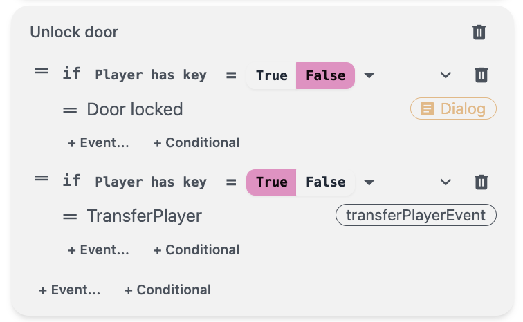

In this guide, we will explore how to connect maps using the Transfer Player event.

TransferPlayer is a function in the game that transports the player to a different map. This is especially useful when you want your player to be progressing through the game, to a different setting or type of map.

## How do I use it?

Transfer Player will be used primarily as part of an event group. Most often, after interacting with an object, or achieving a specific goal such as in a conditional event, the Transfer Player event would be used to progress through the game.

You can add the Transfer Player event when you add a game event in an event group. You can also add it under a conditional event. After you add Transfer Player event, in the drop down menu, you can choose the Map to transfer the player to. Keep in mind, you will have to have created the maps already under the Map tab.

In the Fetch Quest, we used the Transfer Player function to move the player through a door after obtaining a key from a rock. You can refer to that tutorial to see a detailed example in how we used the function under a conditional event.

Important Note: after we create a Transfer Player event, all events that are added afterwards will be greyed out. This means that no further events in the current map will run after the player has been transferred to another map. Therefore, the Transfer Player event must be the last event in the event group.
