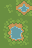

Autotiles make map building faster and less repetitive. Instead of carefully lining up corner pieces and edges, autotiles figure that out for you. Draw with them like a paintbrush, and the right tiles appear automatically.

## What Is an Autotile

An **autotile** is a special type of tileset that knows how to connect itself. When you place autotiles, they generate the correct corners, borders, and fills based on the tiles around them.

In other words, autotiles let you focus on shaping terrain instead of worrying about which piece goes where.

📸 _\[Gif: Example autotile showing corners and borders filling automatically]_

## Common Uses

Autotiles are perfect for:

- Patches of terrain like grass, sand, or water
- Stone paths, dirt roads, walk ways
- Any chunks surface where edges matter

:::note
Avoid using autotiles for the base terrain. If the tile covers most of the map, only the edges of the map will have those borders and corners. They are much better suited for small patches of terrain on top of the base terrain from a tileset.
:::

## Supported Formats

Pixel Stories supports two autotile formats:

- **Wang format** (80x48 px)
- **RPG Maker format** (32x48 px)

Both formats below have dark-gray tiles for edges and corners, and light-gray tiles for the center. You can use the images below as a reference when creating your own autotiles.

 

<pixel-art>

**RPG Maker format**

**Wang format**

</pixel-art>

## Adding Autotiles

You can add autotiles in two ways:

1. Upload your own autotile image
2. Use the **Asset Library**, which includes open source autotiles

Once imported, Pixel Stories generates every tile variation automatically.

📸 _\[Screenshot: Importing an autotile into the editor]_

## Drawing With Autotiles

After you add an autotile, you can paint directly onto the map. The editor automatically chooses the right borders and corners as you draw.

- Use the toolbar tools to draw or erase
- Switch between single tiles and shapes like rectangles or circles
- Erase autotiles just like regular tiles
