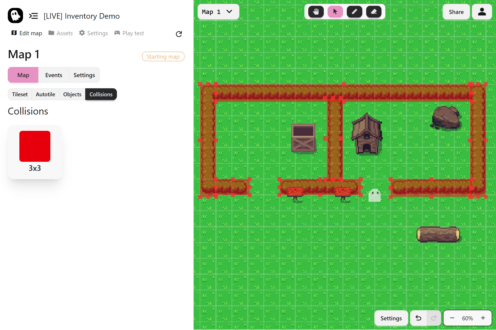

Collisions control where the player can and cannot go in your world. Without them, the player could walk straight through walls, water, or any other obstacle. Collisions are invisible boundaries that keep the player in your map.

## What Are Map Collisions

A **map collision** is an invisible rectangle on the map that blocks the player’s movement. Tiles and autotiles do not have built-in collisions, so you add them separately, overlayed in the map. Map objects have their own collision overlay that can be defined in their configuration.

## Adding Collisions

To add a collision:

1. Select a **Collision** in the collisions tab
2. Place a collision box on the map
3. Drag the corners to resize it to fit the area you want to block

## Keeping Collisions Updated

If you change the terrain on your map, remember to adjust your collisions. For example, if you add a new path or remove a wall, update the collision boxes so the gameplay still makes sense.

:::tip
Always test your map after adding collisions. Walk around as the player to make sure you cannot slip through walls or get stuck in the wrong place.
:::
