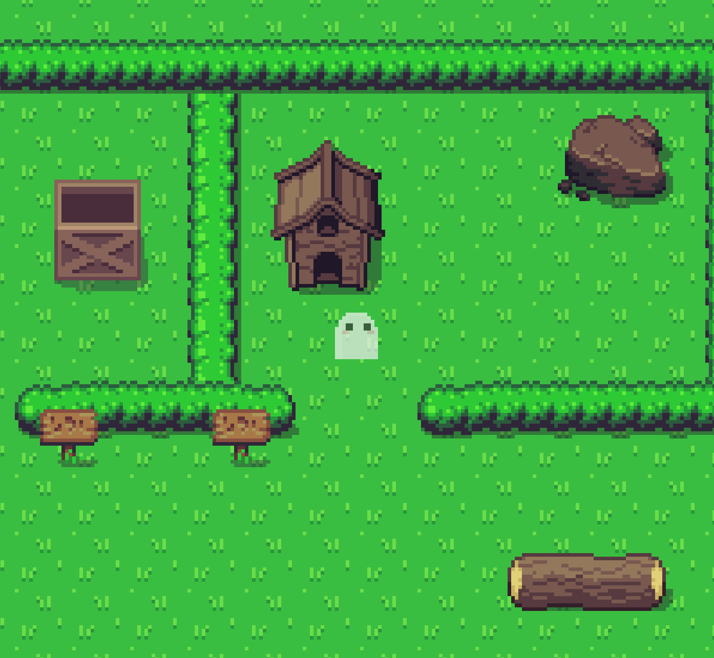
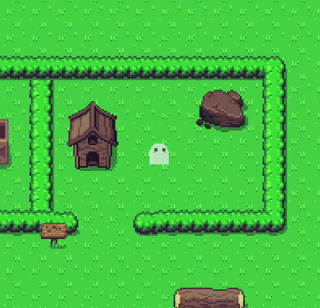
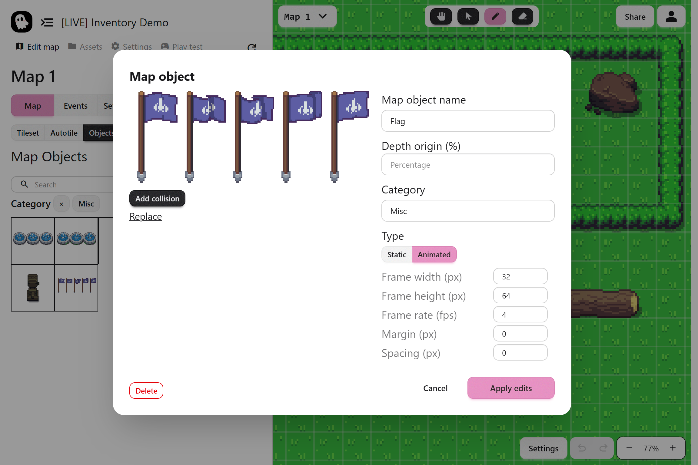
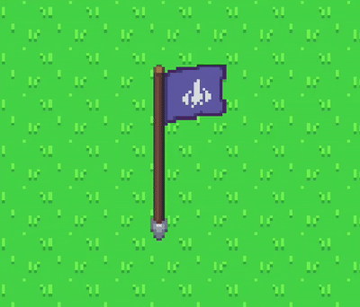
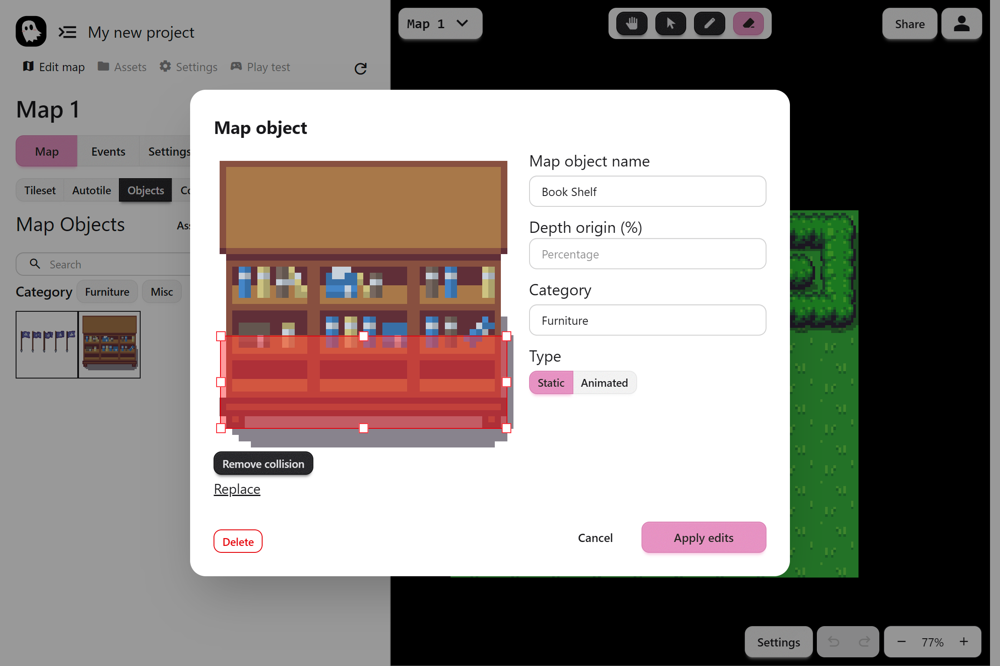

Map objects bring personality and depth to your world. They are everything that sits on top of the terrain, such as trees, houses, furniture, signs. They can even be animated. Map objects make your maps feel alive.

## What Is a Map Object

A **map object** is a sprite that you place onto your map. Unlike tiles, objects are not locked to the tile size and can be any dimensions you want. They also handle depth automatically, meaning if an object is infront of the player, the player will correctly render behind the object.

## Why Use Map Objects

Objects give you more flexibility than tiles:

- **Automatic depth sorting:** The editor figures out whether the player should be in front of or behind an object
- **Free dimensions:** Objects can be any size, even something unusual like 11 × 8 pixels
- **Better organization:** Large maps with lots of detail are easier to manage when objects are separate from tiles

:::note
Map objects are static in the map and cannot be controlled by events. If you are looking for a dynamic and controllable object, use [NPCs](../game-assets/npcs.mdx) instead!
:::

## Adding Objects

You can add objects in two ways:

1. Create them directly in the **Objects tab** of the editor
2. Import from the **Asset Library**, which includes open source objects ready for Pixel Stories

## Animated Objects

Objects can also be animated. Use a sprite strip (a series of frames in one image) and tell the editor the frame width, height, and frame rate. Your object will play that animation on loop in the map.

:::tip
Large projects incur a lot of map objects. To keep everything organized, make sure use descriptive names and assign categories such as Nature, Furniture, or Buildings.
:::

## Depth Origin

The **depth origin** option sets the point of the object that counts as “on the ground.”

- 0 percent means the bottom of the sprite
- 100 percent means the top
- Usually, 0 works fine, but you can adjust it for tall objects

## Object Collisions

By default, objects do not block the player. You can add collisions by clicking **Set Collision** and resizing the red rectangle to match the solid area.

## Using the Toolbar

Once you have objects ready, in the "Objects" tab, select an object and use the top toolbar to:

- Place objects into the map
- Move them around
- Erase them when needed
