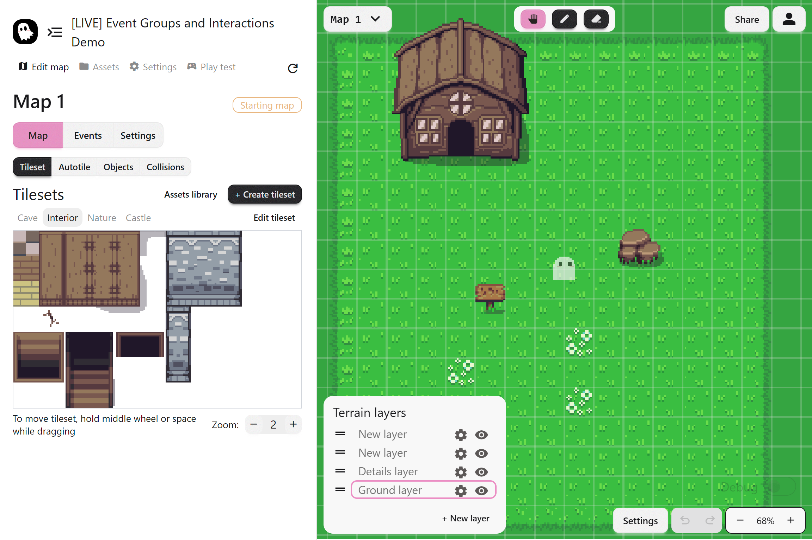

The **Map Editor** is where your world comes to life in Pixel Stories. It is the canvas where you design towns, forests, dungeons, or any kind of world your story needs. Everything you place here (tiles, objects, and collisions) decides how the player explores and interacts with your game.

## What You Can Do

In the Map Editor, you work with four main building blocks:

- **Tilesets:** The base terrain of your world such as grass, stone paths, and walls
- **Autotiles:** Smart tiles that fill in borders and corners automatically
- **Objects:** Sprites that sit on top of tiles such as trees, houses, and furniture
- **Collisions:** Invisible boundaries that stop the player from walking through everything

## The Toolbar

At the top of the editor is the **toolbar**. It changes depending on what you are working on:

- On the **Tilesets tab** you see tools for drawing and erasing tiles
- On the **Objects tab** you see tools for placing, moving, and deleting objects

Think of it like switching toolkits depending on what you are building.

## Map Settings

In the **bottom-right corner** you will find map options:

- Turn grid snapping on or off
- Change the grid size
- Undo or redo changes
- Zoom in and out to work up close or see the big picture

## Next Steps

The Map Editor is just the starting point. Explore these guides for more detail:

- [Tilesets](./tilesets): Learn how to add terrain to your world
- [Autotiles](./autotile): Speed up map design with smart terrain
- [Map Objects](./objects): Add trees, houses, and interactive details
- [Collisions](./collisions): Control where players can and cannot go
