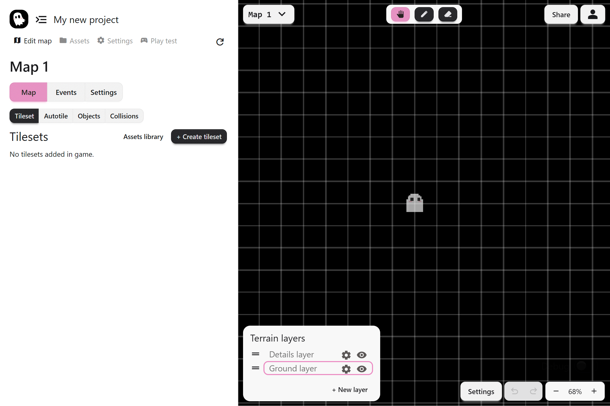

This interface tour gives you a glance at the main parts of the PS Maker editor.

## Editor Layout

- **Left panel:** Configure your game, maps, events, and assets
- **Right panel:** View and edit your game world directly in the editor

## Game Window

In editor mode, the game window shows the active game map. Each game can contain multiple maps. In the **top left** of the game window you can switch between maps and create new maps. In the **top middle**, you'll find the map editor tools. The **bottom left** is your map's tile layers.

## Left Panel Pages

In the top of the left panel are four main pages that give you access to everything else in your game:

- **Edit map:** The Map and Events editors
- **Assets:** Add or edit player animations, NPCs, inventory items, variables, and dialog UI
- **Settings:** Configure global game settings such as title, window size, or rules
- **Play test:** Run a playable version of your game to test changes immediately

The **"Edit map"** page is where you will be spending most of your time creating your story. Below, we'll go through each section within the "Edit map" page.

### Map Editor

The **Map Editor** is where you build your game environments.

You can place:

- **Tilesets:** Base terrain like grass and paths
- **Autotiles:** Smart terrain with automatic borders and corners
- **Objects:** Sprites such as trees, houses, or furniture
- **Collisions:** Invisible boundaries that block the player

Other key tools:

- **Asset Library:** Ready-to-use assets for tiles, terrains, and objects
- **Toolbar:** Editing tools that change based on what you are working on (tile tools on the Tileset tab, object tools on the Objects tab)

See [Tilesets](../map-editor/tilesets), [Autotiles](../map-editor/autotile), [Objects](../map-editor/map-objects), and [Collisions](../map-editor/collisions) to learn more.

### Events Editor

The **Events Editor** is where you create the mechanics of your game. Events drive the story and interactivity. Examples include dialog, choices, showing images, or transferring the player.

- Click **+ Events…** to add a new event
- **Map Events:** Run once when the map loads
- **Event Groups:** Sequences triggered by interaction or touch

See [Events](../event-system/events) and [Event Groups](../event-system/event-groups) to learn more.

### Map Settings

Next to the Events Editor are the **Map Settings**. These apply only to the current map.

Game-wide settings are separate and live in the **Settings page** at the top of the editor.
