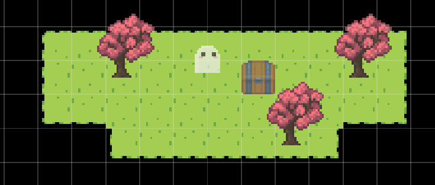

import { Steps } from "@astrojs/starlight/components";

In this tutorial, we’ll learn how to create conditional branching in your game. Conditional branching allows different actions to occur based on player choices or specific conditions, making your game more dynamic and interactive.

## Setting up the Map

First, we need to set up our map with the necessary elements. Add a `tree` and `chest` into your map. You can use the default assets from the `Objects library` in your map under the `Edit objects` tab. See [default assets](/assets) to learn more.



## Creating a Variable

Next, we’ll create a variable to track whether the player has found the key.

<Steps>

1. Navigate to `Game assets > Variables`.
2. Click `+ New switch` to add a switch (true/false) variable.
3. Name the variable "Has key".

</Steps>

## Create Event Groups

Now, we’ll create two event groups: one for finding the key and one for opening the chest.

### Got the Key Event Group

<Steps>

1. Navigate to `Maps > Map 1 > Events` and click `+ Create event group`.
2. Name the event group "Got the key".
3. Add the following events:
   - `Dialog`: Add a dialog event with the text “You found a key!”
   - `Set variable`: Add a set variable event to set the "Has key" variable to true.
4. Under `Map events`:
   - Use the `Add event group` event to add it into the map.
   - Set the `Interact` trigger to a tree.
5. Back in the "Got the Key" event group:
   - Add a `Remove event group` event.
   - Select "Got the key" as the event group to remove.

</Steps>

Note, we had to add the `Remove event group` event after it was added because the engine only allows you to remove event groups which have been added into the map.

### Open Chest Event Group

<Steps>

1. Create another event group and name it "Open chest".
2. Add two conditional events to check if the "Has key" variable is true:

   - **If True**: Add a dialog event with the text:

   ```
   You opened the chest!
   ```

   - **If False**: Add a dialog event with the text:

   ```
   You need the key to open this chest.
   ```

3. Under `Map events`:
   - Use the `Add event group` event to add it into the map.
   - Set the `Interact` trigger to the chest.

</Steps>

You can expand upon this by adding more events for what happens in your game. For example, if the chest is opened, you can spawn a character, make them walk to the player, and create a dramatic scene.

## Play Test

Now, try play testing to see it in action! Walk up to the tree to get the key and then go to the chest to see the different dialogues based on whether you have the key.
