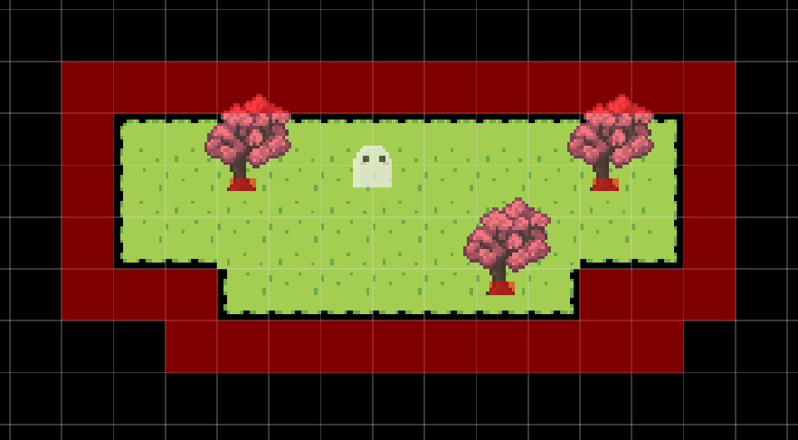

import { Steps } from "@astrojs/starlight/components";

In this tutorial, we'll create our first map. You can find the assets we use below:

<a
  href="https://api.pixelstories.io/storage/v1/object/public/misc/Basic_Tutorial_Assets.zip"
  download
>
  Download the tutorial assets here.
</a>

## Adding a Map

Right now our game is blank because it doesn't have any maps. Let's add our first map.

### New Map

<Steps>

1. Navigate to `Maps` tab.
2. Click `Add map` to create a new map.
3. Name the map "Map 1."

</Steps>

We can leave the map's tile size to be `16px by 16px`.

### Terrains

To draw into the map, we first have to add a terrain. A terrain is an auto tileset generated by a source tileset. We'll be adding the source tileset below.

<Steps>

1. Navigate to `Edit map > Edit terrains` section.
2. Click `+ New terrain` to add a new terrain.
3. Upload the following asset.
   <pixel-art>
   
   </pixel-art>
   _Right click image to copy or save it from browser._  
   You should see a preview for the terrain. That's how it will look when used in the map.

4. Add the terrain.

</Steps>

To draw into the map, select the terrain and click in map to draw. We can use the editing
tools in the tool bar on top of the game window to pan, draw, and erase.

:::note[Map Terrains]

Learn more about adding different types of terrains at [map editor terrains](/features/map-editor/#terrains).

:::

### Map Objects

Our map feels rather empty now... With just some land and no trees. Let's add in some trees!

<Steps>

1. Navigate to `Edit map > Edit objects` section.
2. Click `+ New object`.
3. Upload the following tree sprite asset.
   <pixel-art>
   
   </pixel-art>
4. Add the object.

</Steps>

To place the object in the map, select the object and use the drawing tool to place into the map. If we want to erase an object, we can use the erase tool.

:::note[Editing Objects]

Make sure you are under the `Edit map > Edit objects` tab while drawing or erasing map objects.

:::

Now we can try testing the game. Navigate to the `Play test` tab. Click into the game and you can use the `arrow` or `WASD` keys to walk around. The ghost in the screen you see is the player character.

## Map Collisions

You'll find that the play can walk anywhere in the game, include outside of the terrain we drew. To keep our player in the map, we must add some collisions.

<Steps>

1. Navigate to `Edit map > Edit collisions` section.
2. Select the `16px` collision box.
3. Draw an outline around your map.
4. Add `4px` collision boxes on the base of trees.

</Steps>

Head over to play test, and we'll see our player is bound by the collisions we created!

:::tip[Editing Collisions]

By default, collisions only show while under the `Edit collisions` tab. But you can always toggle the visibility of collisions in the `Map/Grid options` in the top bar above the game screen!

:::
