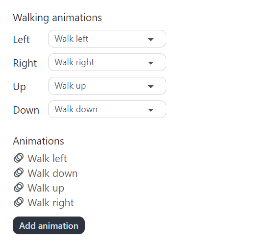
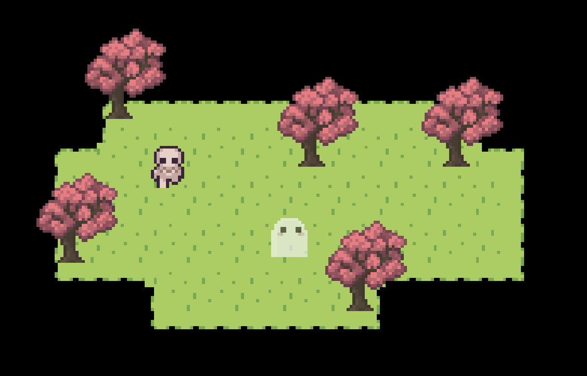

import { Steps } from "@astrojs/starlight/components";

In this tutorial, we'll create our first map and add a new character.

<a
  href="https://api.pixelstories.io/storage/v1/object/public/misc/Basic_Tutorial_Assets.zip"
  download
>
  Download the tutorial assets here.
</a>

## Adding a Map

Right now our game is blank because it doesn't have any maps. Let's add our first map.

### New Map

<Steps>

1. Navigate to `Maps` tab.
2. Click `Add map` to create a new map.
3. Name the map "Map 1."

</Steps>

The map's tile size should be `16px by 16px`.

### Terrains

To draw into the map, we first have to add a terrain.

<Steps>

1. Navigate to `Edit map > Edit terrains` section.
2. Click `+ Add terrain` to add a new terrain.
3. Upload the following asset.
   <pixel-art>
   
   </pixel-art>
   _Right click image to copy or save it from browser._  
   You should see a preview for the terrain. That's how it will look when used in the map.

4. Add the terrain.

</Steps>

To draw into the map, select the terrain and click in map to draw. We can use the editing
tools in the tool bar on top of the game window to pan, draw, and erase.

### Map Objects

Our map feels rather empty now... With just some land and no trees. Let's add in some trees!

<Steps>

1. Navigate to `Edit map > Edit objects` section.
2. Click `Add object`.
3. Upload the following tree sprite asset.
   <pixel-art>
   
   </pixel-art>
4. Add the object.

</Steps>

To draw the object in the map, select the object and use the drawing tool to draw into the map. If we want to erase an object, we can use the erase tool.

:::note

Make sure you are under the `Edit map > Edit objects` tab while drawing or erasing map objects.

:::

## Adding a Character

Now that we have a map, we can add a new character into it! Characters in Pixel Stories are called `Actors`. We'll create them under the `Game assets` tab.

### New Actor

First let's create a barebones actor (actor with no animation sprite) and add it to the map.

<Steps>

1. Navigate to `Game assets > Actors`.
2. Click `Add actor`.
3. Name the actor "Joseph."  
   Leave the rest of the settings as is for now.

</Steps>

With this barebones actor, we can add it into the map with a `Spawn actor` event.

<Steps>

1. Navigate to `Maps > Map 1 > Events`.
2. Click `+ Event` and add the `Spawn actor` event.
3. In the event configuration:
   - Select the actor to spawn as `Joseph`.
   - Set the spawn position in the map.
4. Navigate to `Play test` and we should see the actor spawned in the map.

</Steps>

The new character we spawned in will not have any animations, so we see it with a ghost body.

### Adding Actor Animations

To add an animation for the character, we will go back to the actor settings. In the actor, we'll find the walking animation set as well as the animations for that character. The walking animation set is the animations that play when the actor move around.

<Steps>

1. Navigate to `Game assets > Actors > Joseph`.
2. In the animations section, click `Add animation`.
3. Upload the following animation sprite and name the animation "Walk left."
   <pixel-art>
   
   </pixel-art>
4. In the animation settings:
   - Set frame width as `32px`
   - Set frame height as `32px`
   - Set frame rate as `6`
5. Repeat the steps to add an animation for the following:  
   _Use the `Copy settings` button to copy the animation settings and paste for the other animations_  
   Walk right:
   <pixel-art>
   
   </pixel-art>
   Walk up:
   <pixel-art>
   
   </pixel-art>
   Walk down:
   <pixel-art>
   
   </pixel-art>
6. Don't forget! In the actor's `walking animation set`, select the corresponding animations for each direction.  

</Steps>

The final actor animations should look like this:

  

Head over to `Play test` and we'll see that the character now has the skeleton animations. But since it's not moving, we won't be able to see how the walking animations look. Let's make the character move in the next section.

### Making the Character Move

To see the animations take place, let's make our new character walk around.

<Steps>

1. Navigate to `Maps > Map 1 > Events`.
2. Click `+ Event` and add the `Move actor` event.
3. In the event configuration:
   - Select the actor to move as `Joseph`.
   - Click `Set move path` and click in map to set the movement path.
4. Navigate to `Play test` and we should see the actor spawned in the map.

</Steps>

In the next part of this tutorial, we'll cover how to add dialog and interactions with event groups.
