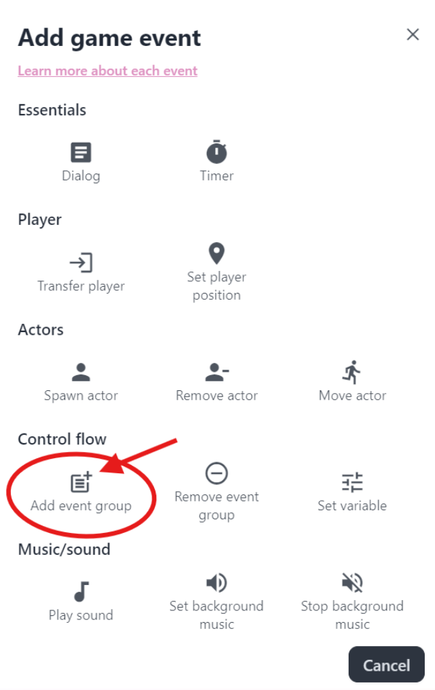

import { Steps } from "@astrojs/starlight/components";

With our map and characters created, now we can add some dialog. After all, they are the bread and butter of story-driven games!

## Showing Dialog

The dialog event shows text in a dialog box in the game.

### Dialog Format

Dialog is written in a specific format. Each line within the text area represents a new dialog box in the game. The word within the bracket adds a name for the dialog, e.g. `[Joseph]`. The name will display in the dialog box until it is changed or reset with empty brackets `[]`.

### Adding Dialog

<Steps>

1. Navigate to `Maps > Map 1 > Events`.
2. Click `+ Event` and add the `Dialog` event.
3. In the event configuration: <br/>
   Paste the following dialog text:

   ```
   Hello World
   [Joe]
   This is written by Joe.
   Hello from Joe!
   []
   Joe doesn't want to talk.
   ```

4. Navigate to `Play test` and we should see the dialog play after the other events finish. <br/>
   Press `Enter` or `X` to play the next dialog.

</Steps>

:::note

Events play one after another. So if you had an actor move event before the dialog, the dialog only shows after the actor is finished moving.

:::

## Adding an Interaction

Our current set up will play the dialog event when the map loads. But what if we want to play dialog when the player interacts with something? To do this, let's add an event group.

### How Event Groups Work

Event groups are a group of events separate from the map's initial events which play on map load. To play the event group's events, we must add it to the map with the `Add event group` event. Once added to the map, they can be triggered by player `Interact` or `Touch`.

Event groups is the feature that allows for multiple endings, dynamic interactions, and puzzles. Learn more about [how event groups work](/features/events-system/#how-group-events-work).

### New Event Group

<Steps>

1. Navigate to `Maps > Map 1 > Events` at the `Event groups` section.
2. Click `+ Create event group`.
3. Click the name to rename the event group as "Talking tree."
4. Add a new dialog event in the event group: <br/>
   Paste the following dialog text:

   ```
   This is the tree talking.
   ```

5. Under the `Map Events` section <br/>
   Add an event and choose the `Add event group` event (see image below).
   - Select `Talking tree` for the event group to play.
   - Set the trigger type to interact.
   - Set the trigger position to a tree in the map.

</Steps>



One thing to note, the event group will not be added until the other events are finished playing.

Now head over to `Play test` and use `Arrow keys` or `WASD` to walk up to the tree. When we press `Enter` or `X`, we should see the dialog play.

## That's All For Now!

Thanks for going through this tutorial! We've gone through creating our map with terrain and objects, adding animations and actors, as well as a bit of the event system. [Join our community on Discord](https://discord.gg/XN9EaUh26g) if you'd like to get more help or give feedback/suggestions.

Good luck in your game creation journey with Pixel Stories!
