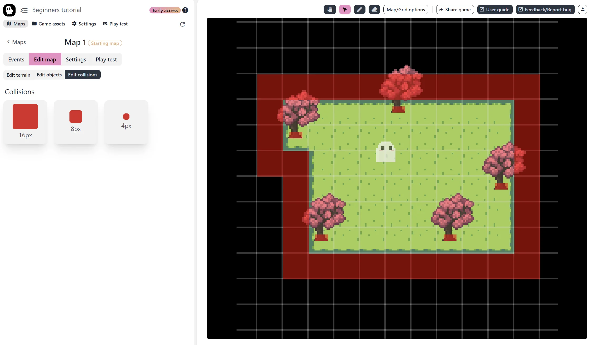
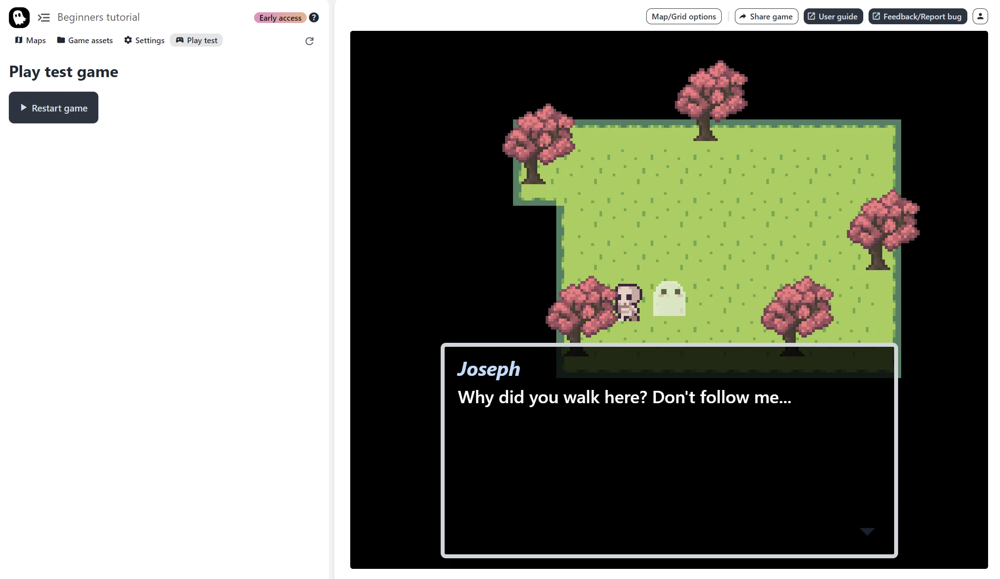
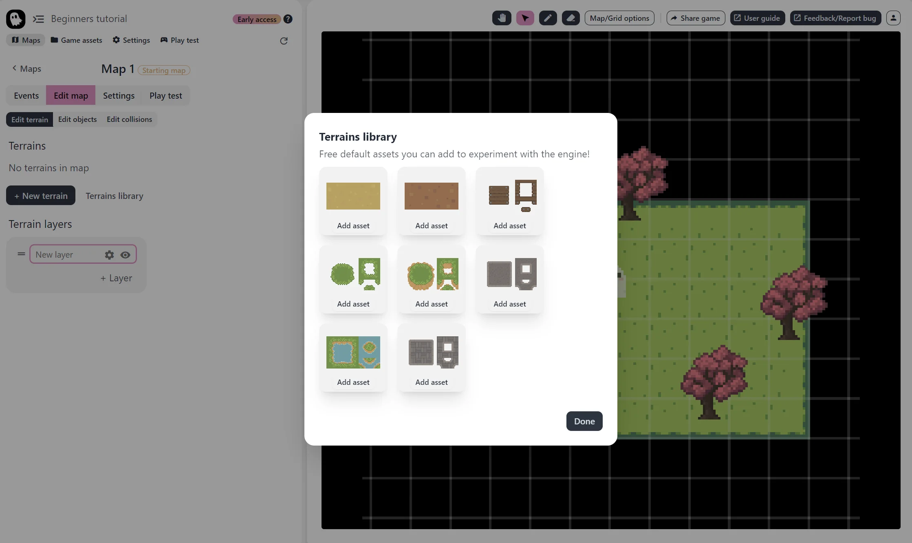

I’d like to formally introduce something I’ve been working on over the past year. It’s called Pixel Stories, a modern, no-code engine made for story-rich games.

## The Motive

The current no-code engines for story-driven games like RPG Maker are amazing and have inspired so many game creators (including me), but it's tough to break away from the classic JRPG style. I wanted an engine that didn’t get in the way for a simple and unique story-rich game. Whether it was the game aesthetic, style, and feel, or just customizing menus and dialog interfaces, removing grid-based movement, setting the map tile size, and game window resolution. The built-in features were limited, often requiring so many plugins or work arounds to achieve what you want.

The solutions either required coding, were outdated, or too complex for me at the time when I was 14 years old and full of inspiration and ideas for story-rich games.

That’s why I wanted to build an alternative. Something that aims to have all the standard features you’d expect built right into the engine. A modern tool that’s nice to work with and empowers your creativity in story-driven game development. It’s in early access beta and there are definitely bugs I’ve yet to catch, but here is what it looks like! The engine is web-based and free if you’d like to jump right in: [https://pixelstories.io](https://pixelstories.io)

## The Features Available Now

- Auto-tiling with terrains
- Sprite placement not locked to grid.
- Events to control what happens in the game.
- Simple game variable management to allow for:
  - puzzles and dynamic game mechanics
  - branching with multiple endings
- Dead simple to change game window size
- Pixel based movement
- Collisions are implemented by drawing collision boxes on top of your map
- Free and engine accessible immediately in the browser
- Replace assets easily with drag and drop.
- No limits on sprite size, map tile size, or number of animation frames

## Note on Default Assets

I want to faciliate creativity with unique games that have unique styles. But I also know that default assets are important for people without the artistic resources or just looking to test the engine. So if you choose to use default assets, they are seamless to replace with custom art once it’s ready.

## Let's Build It Together

Right now I’m looking for help to test out the foundational features. If nothing blows up, then I can focus my time getting the next features in as soon as possible. Features that will be added in the next release:

- Built-in UI customization - custom menu screens, dialog screens, and put interface elements with any shape any where in the game window.
- Dialog choices and options.
- Straight forward dialog editing at scale, with JSON import/export. Localization support.

The engine is free and you can try it out at [https://pixelstories.io](https://pixelstories.io)

Let me know what you think! I hope the Pixel Stories Engine a breath of fresh air and a step in the right direction. (If it’s not, please let me know why as well!) You can find me by email at truman@pixelstories.io.

If you’d like to help drive the development, I am also active on Discord (https://discord.gg/XN9EaUh26g) where you can offer some suggestions, feedback, or just follow along the engine development journey. Thanks for checking it out!
